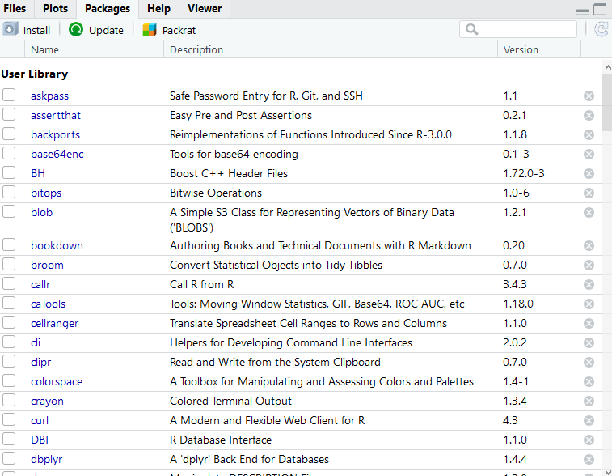

# Introduction

How to get started with R and Rstudio.  

The initial steps are downloading and installing R. This may differ slightly based on your machine.


## Downloading R

Go to the [R website](https://cran.r-project.org). The first box has options for downloading R for Mac, Windows or Linux. Click on the appropriate link.

{width=800px}

**R for Windows**
You will want to click on  $\color{blue}{\text{"install R for the first time"}}$.

{width=800px}

Then follow the instructions.


**R for Mac OS X**
You will want to click on $\color{blue}{\text{"R-4.0.2.pkg"}}$.

{width=800px}

Then follow the instructions.


## Downloading RStudio
Go to the [Rstudio website](https://rstudio.com/products/rstudio/download/). Click **DOWNLOAD** under RStudio Desktop, open source license FREE.

{width=800px}


Then click on the appropriate installer for your computer (Mac, Windows, or Linux).Run the installer and follow the instructions. 


**R for Windows**
You will want to click on the first link $\color{blue}{\text{"RStudio-1.3.1056.exe"}}$.


**R for Mac OS X**
You will want to click on the second link $\color{blue}{\text{"RStudio-1.3.1056.dmg"}$.

{width=800px}

You will always use Rstudio, when working with data. 


<br><br>

## Using RCloud instead of RStudio
[RCloud](https://rstudio.cloud/)

RCloud is a web-based platform for Rstudio, which allows you to perform all visualization and analysis with your data, without downloading Rstudio on to your machine. 

Professor Curley will email you during the first week of class with an invitation link to the PSY317L project on RCloud. Remember you only need to use RCloud if you do not have Rstudio available on your machine. 

Here is what the invitation link will look like: 
{width=500px}

Once you click on the link, you will need to create an account. Please fill in the all section with your own information. 
{width=800px}

RCloud will then prompt you to create a display name for you to go by, remember everyone can see this name so try to make it identifiable and appropriate. After, you enter your display name you will have full excess to the PSY317L project on RCloud. 

{width=800px}

Now that you have the RCloud setup with full access to the PSY317L project, you will be able to perform all exercise you will need to complete for class. 

This is your own work space and changes here can not be seen by classmates. Remember, you will not be able to save all changes to R scripts that are already in the project. However, you could create new Rscripts and save all your code there. 


<br><br>

## Importing Data

There are different options for importing data. It's possible to import data of all different formats into RStudio. We will primarily use spreadsheet type files that have been saved with the ".csv" suffix.  These are called 'comma separated files'.  

**Option 1. Import Tab** You can click on the "Import Dataset" tab in the top right of RStudio - it's located just above your global environment. 

Depending on your RStudio version, you will be asked to select from a dropdown menu. When importing `.csv` files, you want to select `From CSV...` if your menu looks like this:


{width=800px}


If your menu looks like the underneath, then you'll want to select `From Text (readr)`:

{width=500px}


<br>

**Option 2. Writing code.**  This is the option that we will use in our scripts for this course. You may notice that all the datasets that we wish to use are in a folder called "data".  To read in any of these datasets, what we need to do is use the `read_csv()` function.  This comes from a package contained with the `tidyverse` package, so we must have imported that library first.  We then tell it which dataset to find within the 'data' folder. We use the notation "data/..." to tell it to look inside the data folder.  For instance, if we wished to load in the `bmi.csv` dataset, and assign it the name `bmi`, we would do it like this - make sure to put quotes around the whole file name and location:

```{r, message=FALSE}
library(tidyverse)  #load package

bmi <- read_csv("data/bmi.csv") # bring in data

head(bmi) # first six rows

tail(bmi) # last six rows

```

If you want to see more on what the data looks like the following functions can help. 
```{r}
nrow(bmi) # how many rows in dataset

ncol(bmi) # how many columns in dataset

colnames(bmi) # column names
```

If you just want to view your entire dataset, there is a function for that. 

`View(bmi)`


You can also see the struture of your data, whether each variable is a number, character, factor, etc. This will become extremely important when trying to graph and analysis different types of data.  

```{r}
str(bmi)
```
Here you can see that all variables are numeric, except for education with is a character. 

If you need to change the struture of a variable say to a factor to group data in a certain way you would do the following: 

```{r}
bmi$smoke <- as.factor(bmi$smoke)
```

The `$` basically allows you to call certain columns in a datframe. The code `bmi$smoke` is allowing us to only change that column, or variable to a factor without changing anything else in the dataframe. 

You can also change variables to characters with `as.character()` and to numbers with `as.number()`. 


## The RStudio Environment 

{width=800px}

You Rstudio enviornment is separated into 4 main panes. On your machine these panes by be organized differently. You can also change the order of these panes by going your tools tab, then clicking Global preferences. 

First, in the top left, you have a source pane - or script. This is where you will be writing most of your code. You will have to run the code, before seeing the output in the console. These pane is important because this is where you can write and save code for future use. 

Second, on the bottom left, there is the Console. All of the script's output will be assess and found in the console. However, objects in the console will not be saved. 

You can also, type right in the console for fast calculations, like this: 

```{r}
4+5
```

Third, you have a Gobal Environment and History in the top right. Your gobal environment will display all the names of objects you defined in your script. 

Here is an example of a Gobal Environment where you can see dataframes, matrices, values, and functions: 

{width=500px}

If you click the play arrow next to the dataframe, you can view the entire dataframe. This is the save as running the function `View(df)`. Another, important button is the broom icon, if you click this it will clear your gobal enviornment and you will have to rerun code to get any dataframes, function, etc. back. 

  In the History tab, you can see all the code that was once ran through your console. This tab can be important, because as I said before information in the console is never saved and can be deleted easily. Nevertheless, you should get use to saving your code in R scripts, so you will probably not use this tab to often. 


The fourth pane, is the most compacted and has tabs for files, plots, packages, and help. 

  The file tab, allows you access all files on your hard drive.

  The Plot tab, will be filled with plots generated from your code. There are puttons right under the tab to Zoom and Export plots. There is also a button which looks like a broom, this will clear the plots. 

  The Packages tab, has a User Library which is just a list of all the packages you already have install on your machine. You can also install a package, by hitting the install button and then search for your wanted package. The update button will update all packages you already have installed. 
  
  The Help tab, will give you information to help understand different functions and commands in R. You can also call for help with a function right from the console like this:
  
`?t.test`

  

## The Command Prompt
There are several ways to run the code in your script file. 

1. You can highlight your code, then hit 'Run' in the top right corner of the script file. 

2. You can click anywhere on the code, then hit 'Run'

3. You can highlight or click on the code you want to run, then use the keyboard shortcut with is “Command + Return” on Mac, or “Control + Enter” on PC 


## What is an RScript File?
In R, you can code run in the console and a Rscript. 

In the console, the bottom left panel, you type commands and run them by hitting `Enter` on your keyboard. R will show the results in the console as well. All code and results will be forgotten when the R session is close. This is why it is better to you use Rscripts. 

To open new Rscripts you can:
1. click on File -> New File -> R Script 
2. click on the white sheet with green plus sign right under file in your Rstudio environment
3. hit "Ctrl"+ "Shift" + "N" on your keyboard. 

In Rscripts, you can type commands and then run. The results from these commands will still end up in the console, however you will be able to save these Rscripts by hitting file -> Save As... anywhere on your computer.

This allows you to come back later to finish working on some assignment even after you have closed the R session. 

You can also write notes in Rscripts about your data. Any line of code/text with a `#` infront, R knows not to recognize as a command to run. 

For the sake of this class, you are going to want to save all Rscripts in the PSY317L project folder on your computer. This way all of the datasets you will be working with will be in the same folder. 


## What are Packages

When working with R, you will hear about different packages that we will utilize to complete a varity of tasks. 

A package is a collection of code, functions, and sometimes data sets development by others organize and share their work with others. Packages include functions and documentation for others to use to help solve common problem when working with data. You can also create your own package!

There are packages to help tidy data, for visualization, and many different packages for analyzing data. 

There are two ways to download packages on to your computer. 

The first way is through the Packages tab in the right bottom panel in your Rstudio enviornment. In this tab you will see all the packages already installed on your machine.

{width=500px}

Here if you click on install, a box will pop up and your can enter the name of the package you wish to to have then hit install.

{width=500px}

The second way is through one line of code you can write in the console: 

`install.package("tidyverse")`

To have all the packages you will need for this class on your machine, please copy and paste the following code in your console and hit enter: 

`install.packages(c("car", "cion", "gridExtra", "lsr", "moments", "ppcor", "psych", "rcompanion", "tidyverse"))`

Your Console should look like this

{width=500px}


## Project Folders and Working Directories

how projects and folders are managed.

The top level of the the project folder is the one that contains all the folders and looks like this:


This is where R will automatically look for files when you ask it to find stuff.....

and how to refer to folders... e.g. `data/cheese.csv`  - we write it like this as it's the `cheese.csv` file that exists in the folder `data`.  

If you ever need to check where R is looking for things, run `getwd()` and it will tell you where it thinks you are currently working from.


 
## Quitting R 

how to quit from R successful,  you don't have to hit that save object thing all the time....


