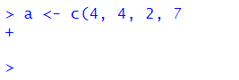

# Basic Syntax

We kind of need to know at least a tiny bit of syntax before we move forward...


keep it very simple.


The Navarro book chapter 3 is excellent for learning syntax.


## boring mathematical stuff

R is, first and foremost, a statistical programming language. So, unsurprisingly, you can do a bunch of mathematical operations fairly easily. Let's do some really tedious math:


You can add with the `+` key:

```{r}
4 + 6
```

You can see that the output returned `10` indicating that that is the answer to `4 + 6`.  However, we also see in the output a `[1]` before it. What does this mean?  This is an index - which we'll talk about in more detail later- but essentially all it is telling us is that the number that comes directly after it is the first bit of the output. We only have one thing in our output here - the number `10`, so it's pretty pointless - but it does have relevance in the future.  For now though, you can safely ignore it.


Subtracting uses a hyphen or minus key `-`:

```{r}
43 - 18
```

Multiplying uses the asterisk `*`:

```{r}
5 * 3
```

Dividing uses this slash key `/`:

```{r}
34 / 7
```


You can square root like so by typing `sqrt()` and putting your number to square root in the brackets:

```{r}
sqrt(45)
```


Squaring a number requires us to use the cute `^` key followed by a number `2` to indicate that we are raising to the power 2 (which is squaring):

```{r}
12^2
```


*Our first little warning*

Like all programming languages, R will only do what it's told. One thing that catches people out is that it will read code in order from left to right.  So, if you're doing several things at once, you may need to insert brackets to make sure that it does what you want it to.  For instance, say you want to multiply 5 by the sum of 7 and 9.

You might write that like this:

```{r}
5 * 7 + 9 
```

but `44` is not the answer you're looking for!  What it has done is to take 5, then multiply it by 7 (makes 35) and then add 9 to make 44. 


OK, how about you write it like this instead:

```{r}
7 + 9 * 5
```

Erm, this time it multiplied 9 by 5 to get 45 and then added 7 to make 52.  What is happening is that some mathematical operations are taking precedence over others and R does things in certain order. To explicitly make sure that it does what you want, insert some brackets like this:


```{r}
5 * (7 + 9) 
```

Now it **knows** that what you wanted to do was to add 7 and 9 to get 16 and have that number multiplied by 5 to get 80.  This sort of thing is something to look out for, but as you get experienced you'll have a sense for it. Well placed brackets can save you a headache.


## assignment
e.g. what the assignment operator is.

This symbol `<-` which is just a "greater than sign" followed by a "hyphen" is called an assignment operator. It basically is equivalent to saying you want to save something.  You write what you want to be saved on the right hand side of it, and the name of your newly saved thing on the left of it.  We call the 'thing' that you've saved an 'object' in programming speak.

For instance, say you wanted to save the number `17`, and you wanted to call that saved number an object called `x`. You'd do it like this:


```{r}
x <- 17
```

Now, whenever you type, `x`, R thinks that it is the number 17.


```{r}
x 
```


We should probably fess up right now and tell you that there is another way that you can assign things in R. On the face of it, it's a much easier way too, but we're going to recommend you don't do it. The only reason that we're bringing it up at this point is that if you look up help on the internet or in some books, you'll see people doing it - so we should mention it.

You can assign using the equal key `=` like this:

```{r}

y = 10 - 2

y
```

So, as you can see, we created an object called `y` that was equal to 10 minus 2, that is 8. Using `=` seems so much easier than using `<-` so what is the reason not to do it?  Well, the equal sign gets used for a ton of other commands and sometimes it gets a little messy and confusing if too many equal signs fly around.  Thefore, we're going to politely ask that whenever you assign things, please use the `<-` operator, even though it's two bits of punctuation stuck together:

```{r}

hooray <- 17 + 4  # thanks for using this sign
hooray
```


## vectors

Of course, you can save even more complex things as the object. For example, if you wished to save the numbers `5, 6, 7, 8, 9, 10`, you have two ways of doing that.  Let's just see them in action, and then we'll explain the syntax:

```{r}

v1 <- 5:10

v1

v2 <- c(5,6,7,8,9,10)

v2

```


As you can see both `v1` and `v2` are our newly saved objects and they both contain the numbers 5 through 10.  For `v1` we separated the numbers 5 and 10 with a colon `:`.  In R, the `:` sign can be used to mean "to" when talking about a series of numbers. e.g.

```{r}
5:10

101:103
```


The other way we did it with `v2` was to use the `c()` function. This stands for `concatenate` which is a mouthful.  Basically, it's a way of sticking things together.  You write `c()` and then put the stuff you want to stick together inside the brackets, but make sure you separate each thing by a comma `,`.  For example,

```{r}
c(1,10,100,1000)

c(4,6,8,10,8,6,1)

```


Another bit of terminology might be worth mentioning right now.  Our saved objects `x`, `v1` and `v2`, as well as being called `objects` can also be called `vectors`.  A vector is something in R that contains several items. These items are actually called `elements`.  Importantly the items are indexed, which means that they are in order, not all jumbled up.  That means that you can directly grab an element by it's position.  So, if you wished to get the first element (or item) of the object `v1` you'd type like this:

```{r}
v1[1]
```

That returns '5' which was our first element we put into the vector.

If we wish to get the 3rd element of `v1` we'd do this:

```{r}
v1[3]
```

And, if we wished to get the first, second and third element of `v1` we'd do this:

```{r}
v1[1:3]
```


blah blah blah


does the image appear above?


I just remembered that if you don't want the image to appear inline, then you leave out the ! from the markdown syntax.

[summary image](img/vector.png)


    
    

Now, one of the great advantages of vectors is that you can do things to all of the numbers inside the vectors at once.  For instance, say we wanted to square all the numbers inside of `v1`, then all we need to do is:

```{r}
v1^2
```

and notice how it squared the numbers 5 through 10 that are the contents of `v1`.


You can also do things to the entire contents of a vector at once.  For instance, if you wanted to add up all the numbers in `v1` you could do this by using the function `sum()` like this:

```{r}
sum(v1)
```

and it added 5+6+7+8+9+10 to give one answer!


## Some things that are useful to know.

**whitespace**

R doesn't, on the whole, care that much about whitespace - this is space that is between code. It just ignores it.  For instance, all of the following give the same result (what's happening here is that `a` and `b` are `vectors` that each have three `elements`. Telling `a+b` will make it add the first element of `a` to the first element of `b` and then the 2nd element of `a` to the 2nd element of `b` and so on:

```{r}
a <- c(1,2,3)
b <- c(4,5,6)
a + b
```


```{r}
a<- c(   1,            2,     3)
b <- c(4,5,6           )
a +              b
```


```{r}
a <- c(1    ,2,   3)
b <-    c(    4,5  ,6)
            a +    b
```


Hopefully, you get the point.


**Don't typo!**

R can only understand what you tell it. Typos can be bad. In fact, the most common error people make is to misspell or to use the wrong case when typing.  Here are some examples of code that won't work because we typed something wrong:

```{r}
a <- c(5, 7, 8)
```


**Other common errors**


*Close your brackets*

Missing commas or brackets might be the most common errors! You will get an error message though, and it usually will tell you what you did wrong.  Also, when you start to type `(` RStudio will automatically autocomplete to write `()` which helps you to not forget to close your bracket.  

```{r, error=TRUE}
a <- c(4, 4, 2, 7
```


When you forget to close your brackets, but you run your code anyway, you'll notice that in your console you get a flashing bar and the cursor still has a plus sign like this :


This is telling you that it's waiting for something else to finish the code. It expected you to close your brackets!  If you do this and you want to reset to get back to the `>` cursor sign (which means it's ready for action), then just click next to the plus on the flashing `|` and hit `Esc` key.  This should reset it to the `>` cursor, and look like this:




*Don't forget commas*


Commas need to be watched out for too.  They are usually used to split separate items up, such as numbers in a vector or arguments in a function (see section xxx.xxx).  Missing them out can cause issues! For instance, here we are trying to make the vector `b` have the numbers 3, 6, 9 & 10.  But the way we write it, R might think we mean 3, 6 & 910 because we forgot the comma. Remember, R often ignores spaces. Fortunately, R catches it because it 'knows' numbers need to be paid attention to - and suggests that you've missed out a comma. Well, technically it tells you `Error: unexpected numeric constant in ....` which doesn't help much - but it's because we forgot the comma.

```{r, error=TRUE}
b <- c(3, 6, 9 10)

```


RStudio can help you as you write code. During most of this course, you will be following code already written by us. However, in the `try for yourself` examples, you'll have to fill in blanks.  Whenever there is an issue with code and it won't run, RStudio flags this for you as soon as it realizes. It will give you a big red circle with an X inside of it.  These appear in your script. You can see an example below for our problems with missing brackets and commas.


*Check your quote marks*


*Typos are bad!*


typos not good 


## Error Messages

We'll be honest here and say that often times when you get an error message, they aren't massively helpful. Or, at least this was the case until recently.  There still are many error messages that don't really help you too much in learning what you did wrong, but if you make errors when using the `tidyverse` (see section xxx.xxx) such as when making visualization - these error messages are much more helpful now than they once were.

Making errors when coding is part of the learning curve though. It's like learning to play the piano. There is almost no way you can do it just by watching somebody else. You have to practice and be ok with making small mistakes. At first they catch you out, but over time you'll realize when you're about to mess up and you'll avoid it. Or, you'll mess up and be faster at working out how to get past it.

If people are stuck on particular error messages during this course - please do let us know. We'll try and collate an FAQ of error messages that we can provide answers to - that will hopefully make the learning process a lot less painful.


simple math

doing things in the right order.


assignment

obj*obj


objects - what you can and can't name them

characters._09  no spaces. no other punctuation
dont start with _ or 09.

there are some special words to not use.
if, else, repeat, while, function, for, in, next, break, TRUE, FALSE, NULL, Inf, NaN, NA, NA_integer_, NA_real_, NA_complex_, and finally, NA_character_.

i'd recommend not calling things 'c' or 't' also.

dont make them too long, make them easy to remember.


logic statements

"is equals to"
"is not equal to"

2+2 == 4
2+2 == 5
<
<=
>
>=


Functions:
parameters/arguments...

name()

e.g. sqrt()
abs()
round(3.555,1)
default arguments...

round( x = 3.1415, digits = 2 )

dont put them the wrong way round:
round( 2, 3.14165 )


somethings that can help with rstudio:

autocomplete....
shows function name as well as arguments


vectors....  what they are

functions can be applied to the whole vector
or you can do it to each element of the vector

vector output is over the whole console

vector indexing

you could change individual values in vectors

length


vectors dont have to be numbers, can be text e.g.

months <- c("January", "February", "March", "April", "May", "June",
            "July", "August", "September", "October", "November", 
            "December")

length still works

obvs cant do math....
can do other things...

nchar()

substr(1,3)


# can also have vector of logicals

x <- c(TRUE, TRUE, FALSE, FALSE, TRUE)

sum(x)  actually works

e.g. 

v <- c(5, 7, 11, 3, 6, 10)

v>=7
sum(v>=7)


# more on indexing vectors

v[c(3,4,5,11)]

v[c(3:8)]

v[v>5]

months[v>5]  # if v had 12 numbers in it.


# give vectors names

names(v) <- months


stock.levels<-c("high", "high", "low", "out", "out", "high",
                "high", "high", "high", "high", "high", "high")

stock.levels

months[stock.levels == "out"]
months[stock.levels != "out"]

months[stock.levels == "out" | stock.levels == "low"]

months[stock.levels %in% ...]


