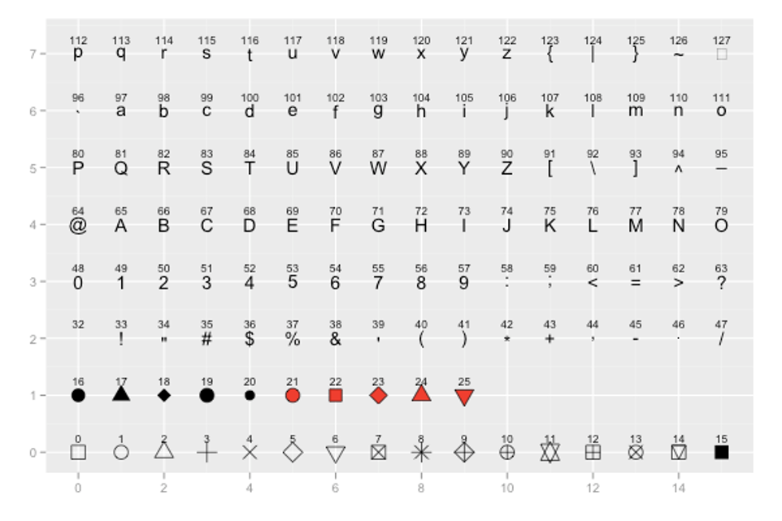

# Data Visualization 

The package `ggplot2` is used to visualize data. Before starting you should load the `tidyverse` package, which includes `ggplot2` and other tools, at the very top of your script. 

```{r message = FALSE}
library(tidyverse)
```

## Intro to ggplot2

Read in data

```{r}
df <- read_csv("data/BlueJays.csv")
```

Start with a black canvas 

``` {r}
ggplot()  
```

Just adding the datset to the blank canvas, but nothing plotted yet.

```{r}
ggplot(df)   
```

You need to  use aes() for every ggplot you make, and inside aes() we'll put what our x and y axis will be. 

We say what the x and y are, and it creates scales on each axis, but we didn't tell it what to plot yet.

```{r}
ggplot(df, aes(x=Mass, y=Head) )   
```

Need to add points. 
```{r}
ggplot(df, aes(x=Mass, y=Head) ) + geom_point()
```

What if we want to change the color of the points?
```{r}
ggplot(df, aes(x=Mass, y=Head) ) + geom_point(color='red')
```


What if we want to color the points based on another variable
```{r}
ggplot(df, aes(x=Mass, y=Head, color = KnownSex) ) + geom_point() 
```

Basically, you can just keep adding to the initial plot to make your graph the best visualization to fit your data. 


There are many different graphs you can make with `ggplot`. What graph you make will depend on what type of data you have and what you want to visual from your data. 

The next couple sections will take the base of ggplot and show you examples with different types of points. They will start general then show you how to customize plots. 

General information about customizing plots in ggplot:
 1. ALLL THE COLORS IN THE WORLD
 https://www.datanovia.com/en/blog/awesome-list-of-657-r-color-names/
 http://www.stat.columbia.edu/~tzheng/files/Rcolor.pdf

 2.  change the type of points you plot with `geom_point(pch = blah)`:
 
 


Also, you can change the color and size of points by `geom_point(size = 3, color = "blue"). 


3. Built in themes: 

theme_bw() 
a variation on theme_grey() that uses a white background and thin grey grid lines.

theme_linedraw() 
A theme with only black lines of various widths on white backgrounds, reminiscent of a line drawing.

theme_light()
similar to theme_linedraw() but with light grey lines and axes, to direct more attention towards the data.

theme_dark()
the dark cousin of theme_light(), with similar line sizes but a dark background. Useful to make thin colored lines pop out.

theme_minimal()
A minimalistic theme with no background annotations.

theme_classic()
A classic-looking theme, with x and y axis lines and no gridlines.

theme_void()
A completely empty theme


REFERENCE: your slides elol and https://ggplot2-book.org/


## Histogram
Why make a histogram?

Histograms are a good place to start with your data, it will give you a visual representation of your data distribution. blah probably needs more, idk what to say. 

Load libraries and data
```{r}
library(tidyverse) 
df <- read_csv("data/films.csv")

head(df)

```

Making a ggplot2 histogram, which will plot imdb scores. 

```{r}

ggplot(df, aes(x=imdb)) + 
  geom_histogram()  
```

Now lets make the bars doderblue and border them white. 

```{r}
ggplot(df, aes(x=imdb)) + 
  geom_histogram(color='white', fill="dodgerblue") 
```

You can also control the bin width of histograms, this code has a  bin width of 0.2 rating points

```{r}
ggplot(df, aes(x = imdb)) + 
  geom_histogram(binwidth = 0.2, color="white", fill="dodgerblue") 
```

Further you can control where the boundaries of each bin lie on the x-axis

```{r}
ggplot(df, aes(x = imdb)) + 
  geom_histogram(binwidth = 0.2, color="white", fill="dodgerblue",boundary=4) 
```

Just be careful with using the boundaries that it does not crop your histogram incorrectly. Changing histograms too much can lead to miss representing the data. (idk if that is said correctly)

Here is the full code with some additional customizations 

```{r}
ggplot(df, aes(x = imdb)) + 
  geom_histogram(binwidth = 0.2, color="white", fill="dodgerblue",boundary=4) +
  theme_classic() +
  ggtitle("Histogram of IMDB Ratings") +
  xlab("Rating") +
  ylab("Frequency")
```

Instead of Viewing as a histogram, you can also show the data as a density curve

```{r}
ggplot(df, aes(x = imdb)) +  geom_density(color = "navy", fill = "dodgerblue") 
```

Adding, alpha gives it a bit of transparency

```{r}
ggplot(df, aes(x = imdb)) +  
  geom_density(color = "navy", fill = "dodgerblue", alpha=.4)
```

**Comparing Distributions** with side by side Histograms

Switching to new data 

```{r}
life <- read_csv("data/lifeexp.csv")

head(life)
tail(life)
```

First lets plot a histogram of life Expectancy across all countries

```{r}
ggplot(life, aes(x=lifeExp)) + 
  geom_histogram(color='white', fill='lightseagreen') #warning is ok
```


Since we've combined data from the two years - we should separate histograms for each year. We can do this by Overlaiding histograms.

```{r}
ggplot(life, aes(x=lifeExp, fill=year)) +  
  geom_histogram(position="identity") #horrible
```

That graph was horrible, but if you costomize the plot by defining binwith and adding an alpha level it will get better.  

```{r}
ggplot(life, aes(x=lifeExp, fill=year)) +  
   geom_histogram(position="identity", alpha=.5, binwidth=2)
```

Let add color now to make it even better, this makes the borders and fill of the bars black

```{r}
ggplot(life, aes(x=lifeExp, fill=year)) +  
  geom_histogram(position="identity", alpha=.5, binwidth=2, color='black') +
  scale_fill_manual(values = c("#999999", "#E69F00"))

```

Comparing Distributions can also be done with `geom_density()`, this is usually simpler to compare. 
  
Initial plot 

```{r}
ggplot(life, aes(x=lifeExp, fill=year)) +  
  geom_density(aes(fill = year), alpha = 0.4) 
```

Adding customized colors 

```{r}
ggplot(life, aes(x=lifeExp, fill=year)) +  
  geom_density(aes(fill = year), alpha = 0.4) +
  scale_fill_manual(values = c("#999999", "#E69F00"))
```

And adding a theme

```{r}
ggplot(life, aes(x=lifeExp, fill=year)) +  
  geom_density(aes(fill = year), alpha = 0.4) +
  scale_fill_manual(values = c("#999999", "#E69F00"))  + 
  theme_classic()
```

## Scatter

Scatter plots are used when you are trying to illustrate a trend in your data. These plots can be important in statistics because it can help show the correlation between two variables. 

`geom_point()` is used for scatter plots. 

Lets look at the dataframe cheese: 

```{r}
cheese <- read_csv("data/cheese.csv")
head(cheese)
```

Start with a simple plot looking at the outcome of cholesterol on saturated fat intake. 

```{r}
ggplot(cheese, aes(x=sat_fat, y=chol) ) + geom_point()
```

Adding color

```{r}
ggplot(cheese, aes(x=sat_fat, y=chol) ) + 
  geom_point(color = "purple")
```

Adding trend line with `geom_smooth`

```{r}
ggplot(cheese, aes(x=sat_fat, y=chol) ) + 
  geom_point(color = "purple") +
 geom_smooth(method = "lm")
```
Here you can see it automatically puts a shaded area around your trend line, this is supposed to represent the confident interval. There is a way to get rid of it - 

```{r}
ggplot(cheese, aes(x=sat_fat, y=chol) ) + 
  geom_point(color = "purple") +
 geom_smooth(method = "lm", se = FALSE)
```
You can also change the color of the trend line, by adding to `geom_smooth()`

```{r}
ggplot(cheese, aes(x=sat_fat, y=chol) ) + 
  geom_point(color = "purple") +
  geom_smooth(method = "lm", se= F, color = "black")
```


Label your x and y axis 

```{r}
ggplot(cheese, aes(x=sat_fat, y=chol) ) + 
  geom_point(color = "purple") +
  geom_smooth(method = "lm", se= F, color = "black") +
  xlab(" Saturated Fat Intake") +
  ylab("Cholesterol")
```

Add a title and a theme to make your graph complete

```{r}
ggplot(cheese, aes(x=sat_fat, y=chol) ) + 
  geom_point(color = "purple") +
  geom_smooth(method = "lm", se= F, color = "black") +
  xlab(" Saturated Fat Intake") +
  ylab("Cholesterol") +
  ggtitle("Saturated Fat Intake and Cholesterol") +
  theme_minimal()
```

## Line

Line graph help connect values (y-axis) over time (x-axis)

```{r}
jennifer <- read_csv("data/jennifer.csv")

head(jennifer)
tail(jennifer)
```

How to build up a line graph, start just like the other graphs

```{r}
ggplot(jennifer, aes(x=year, y=n) ) 
```

Look at data as points first 
```{r}
ggplot(jennifer, aes(x=year, y=n) ) + geom_point() # look at data as points
```

Then as a line 
```{r}
ggplot(jennifer, aes(x=year, y=n) ) + geom_line() # instead use a line
```

You can add points and line together 
```{r}
ggplot(jennifer, aes(x=year, y=n) ) + 
  geom_point() +  
  geom_line() 
```

Changing Color of Line, but **not** the points
```{r}
ggplot(jennifer, aes(x=year, y=n) ) + 
  geom_point() +
  geom_line(color = "purple") 
```

This will change the color of both the points and the line
```{r}
ggplot(jennifer, aes(x=year, y=n) ) + 
  geom_point(color = "violet") +
  geom_line(color = "purple") 
```

Customize axis labels and title

```{r}
ggplot(jennifer, aes(x=year, y=n) ) + 
  geom_line(color = "purple") +
  xlab("Year") +
  ylab("Number of Children Born") +
  ggtitle("Popularity of Name Jennifer in USA")
```

Can change width of lines
```{r}
ggplot(jennifer, aes(x=year, y=n) ) + 
  geom_line(color = 'purple', lwd=2)
```


There are many different style of lines here are a few examples

```{r}
ggplot(jennifer, aes(x=year, y=n) ) + geom_line(lty=1)
```

```{r}
ggplot(jennifer, aes(x=year, y=n) ) + geom_line(lty=2)
```

```{r}
ggplot(jennifer, aes(x=year, y=n) ) + geom_line(lty=3)
```

```{r}
ggplot(jennifer, aes(x=year, y=n) ) + geom_line(lty=4)
```


Plotting **multiple** lines on same graph

read in data 
```{r}
jenlinda <- read_csv("data/jenlinda.csv")

head(jenlinda)
tail(jenlinda)
```

Just one line 
```{r}
ggplot(jenlinda, aes(x=year, y=n, color=name)) + geom_line()
```


Two lines - one for each name. 
```{r}
ggplot(jenlinda, aes(x=year, y=n, color=name)) + 
  geom_line()+
  xlab("Year") +
  ylab("Number of Children Born") +
  ggtitle("Popularity of Names Jennifer & Linda in USA")
```


## Boxplot 

Boxplot can also be used when looking at the distribution of data. These plots can show the median value and quartiles ranges of the data. 


Import and look at data
```[r]
wheels <- read_csv("data/wheels1.csv")
head(wheels)
tail(wheels)
```

You can get more information about the data and general summaries by using the following code

```{r}
table(wheels$strain)

summary(wheels)
```


Plotting the data with `geom_boxplot()` 
```{r}
ggplot(wheels, aes(x = strain, y = total)) + 
  geom_boxplot()  
```


The warning message is ok - it's saying some rows don't have data. However, notice the outlier. 


You can overlay the points on the boxplot, which can help you visualize the spread of the dta. 

```{r}
ggplot(wheels, aes(x = strain, y = total)) + 
  geom_boxplot() + 
  geom_point()
```


You can customizing colors by chaning the fill and color of boxplots
```{r}
ggplot(wheels, aes(x = strain, y = total)) + 
  geom_boxplot(color="navy", fill="dodgerblue") +
  geom_point(color="navy")
```


You can also make the points wobble a bit... 
 but careful it goes crazy...

```{r}
ggplot(wheels, aes(x = strain, y = total)) + 
  geom_boxplot(color="navy", fill="dodgerblue") +
  geom_jitter(color="navy")
```

You can constrain it by setting a width value of how much wobble.

```{r}
ggplot(wheels, aes(x = strain, y = total)) + 
  geom_boxplot(color="navy", fill="dodgerblue") +
  geom_jitter(color="navy", width = .1) 
```

Finish the graph by adding titles and labels etc.

```{r}
ggplot(wheels, aes(x = strain, y = total)) + 
  geom_boxplot(color="navy", fill="dodgerblue") +
  geom_jitter(color="navy", width = .1) +
  xlab("Mouse Strain") +
  ylab("Total Wheel Revolutions") +
  ggtitle("Wheel Running By Different Mouse Strains") +
  theme_classic()
```


A couple of other things you might want to try:

1. Make the outlier more noticeable
```{r}

ggplot(wheels, aes(x = strain, y = total)) + 
  geom_boxplot(outlier.color = "green", outlier.size = 8)
```

2. If you prefer violin shapes to boxplots
```{r}
ggplot(wheels, aes(x = strain, y = total)) +  geom_violin()
```


3. You can also color according to the x-axis category
```{r}
ggplot(wheels, aes(x = strain, y = total)) + 
  geom_boxplot()


ggplot(wheels, aes(x = strain, y = total, fill = strain)) + 
  geom_boxplot()
```

4. Adding points
```{r}
ggplot(wheels, aes(x = strain, y = total, fill = strain)) + 
  geom_boxplot() +
  geom_jitter(width=.1)
```

## Bar Graphs  

Bar graphs are used to  visualize groups of differing amounts. Bar graphs are best when the changes between groups are larger. 


Example 1. If you have a dataset where you **HAVE** already counted the number of each group


Import the number1s.csv data.  This shows how many number 1 songs various artists have had in the UK singles charts.

```{r}
data <- read_csv("data/number1s.csv")
head(df)
```


`geom_col()` is used when the data is already counted.

```{r}
ggplot(df, aes(x = name, y = total) ) + geom_col()
```
Notice default order is alphabetical. However, you can reorder by putting reorder around the x-axis column.

```{r}
ggplot(df, aes(x = reorder(name, total), y = total) ) + geom_col()

ggplot(df, aes(x = reorder(name, -total), y = total) ) + geom_col()
```

When changing color use 'fill' here because it's a shape.
```{r}
ggplot(df, aes(x = reorder(name, -total), y = total) ) + 
  geom_col(fill = "yellow")
```

Then for the border of the bars use 'color'. 
```{r}
ggplot(df, aes(x = reorder(name, -total), y = total) ) + 
  geom_col(fill = "yellow", color="black")
```

Finish with final customizations 
```{r}
ggplot(df, aes(x = reorder(name, -total), y = total) ) + 
  geom_col(fill = "orange", color="brown") +
  xlab("Artist") +
  ylab("Total Number 1's") +
  ggtitle("Number 1 hits in UK") +
  theme_classic()
```


Example 2. If you have a dataset where you haven't already counted the number of each group

We want to plot how many people have each type of pet.

This means pet will be on x-axis, and count on y-axis.

load in pets.csv dataset and look at the data. 

```{r}
pets <- read_csv("data/pets.csv")

head(pets)
tail(pets)

```
Notice 'pet' is categorical.
We don't yet have a 'count' of how many of each pet there is.

We can quickly look at the 'count' like this:
```{r}
table(pets$pet)
```

We can make ggplot plot the frequency/count of each pet as a bar graph

Notice here, we use `geom_bar()` - and it counts for us.
We do not need to supply a y column.

```{r}
ggplot(pets, aes(x = pet)) + geom_bar()
```

Then just customize.
```{r}
ggplot(pets, aes(pet)) + 
  geom_bar(color="black", fill="plum3") +
  xlab("Pet")+
  ylab("Total")+
  ggtitle("Popularity of Pets in a Class")
```

## All the extras 


