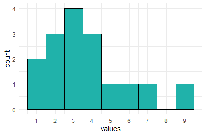

# Data Visualization 

In this chapter we shall discuss how we can make different types of data visualization in R. We will use the package `ggplot2` to visualize data. This is part of the `tidyverse` package, meaning you should load `tidyverse` to ensure you have `ggplot2` loaded.

We shall also discuss a little bit about when to make different types of graphs, and what each type is best suited for. We will also give a few pieces of advice about how to make your visualizations as readable and interpretable as possible. For much more information on the theory of data visualization with excellent examples, please refer to the [Fundamentals of Data Visualization](https://serialmentor.com/dataviz/) book by Claus Wilke.


## Introduction to ggplot2

The first thing to do when we want to make a visualization with `ggplot2` is to load the tidyverse:

```{r, message = FALSE}
library(tidyverse)
```


Next, let's load in some data. We'll pick the `BlueJays.csv` data:

```{r, message=FALSE, warning=FALSE}
df <- read_csv("data/BlueJays.csv")

head(df)

```


In the next few steps, we'll slowly build up a plot using `ggplot2`. This is **not** how you would typically write the code. However, it is worth going step by step, just to show you the logic behind the code.


If we just run the function `ggplot()` notice that all we get is a blank gray canvas. R knows that we want to make a plot, but it has no idea what type of plot or with what data - so it just throws up the canvas:


``` {r, fig.width = 5, fig.height = 3}
ggplot()  
```


Now, if we add the dataset to `ggplot()`, it still only gives us the blank canvas. It now knows we want to make a graph from the dataset called `df` but doesn't plot anything yet as we didn't tell it what to plot:

```{r, fig.width = 5, fig.height = 3}
ggplot(df)   
```


For R to 'know' what you are trying to plot, you need to use **`aes()`**. You put that most of the time inside `ggplot()` after your dataframe name.  (There are exceptions to this, but let's not worry about that yet). Inside the `aes()` we'll put what columns contain our data for the x and y axes. We may also refer to other columns inside `aes()` if we wish to modify the color or shape or something else about our data based on the values in some column.


For our first example, let's make a **scatterplot** of body mass against head size of these Blue Jays. If you look at the original dataset, you'll notice that both the `Mass` and `Head` columns contain continuous numeric data (i.e. they are numbers). 

In the code below, we are telling `aes()` to plot the `Mass` data on the x-axis and to plot the `Head` data on the y-axis.

```{r, fig.width = 5, fig.height = 3}
ggplot(df, aes(x=Mass, y=Head) )   
```

Something did change this time. We get a plot with labels on the x- and y-axes. It recognizes that we wish to plot `Mass` and `Head` data. It even knows the range of our data on each axis. For instance, it knows that the Mass data lies somewhere between 55 and 85.  However, we haven't yet told it precisely what type of plot we want to make (it doesn't just assume that we wanted to make a scatterplot - it can't read our minds).

So our next step is to tell it to make a scatterplot by adding points to the graph.  We tell `ggplot()` what we are adding to the chart by using different `geoms`. For a scatterplot, the geom we require is `geom_point()` - that means add datapoints. It is hard to remember all the different geoms, but you can just look them up.

Here is how we add datapoints to our graph with `+ geom_point()`.  

```{r, fig.width = 5, fig.height = 3}
ggplot(df, aes(x=Mass, y=Head) ) + geom_point()
```

That is our first ggplot graph! It looks pretty good. The amazing thing about ggplot is almost everything you are looking at on that graph can be customized to your preferred design choice. We'll discuss several of these customizations throughout this chapter. First, let's talk about changing the color of the datapoints. Inside of `geom_point()` we can change the color of all the points like this:


```{r, fig.width = 5, fig.height = 3}
ggplot(df, aes(x=Mass, y=Head) ) + geom_point(color="red")
```

This made the points red. Just make sure you put a recognized color name ([you can look them up here](http://www.stat.columbia.edu/~tzheng/files/Rcolor.pdf)) or a recognized [hex code](https://htmlcolorcodes.com/color-picker/).  Notice though that color name must be put inside of quotes.


What if we want to color the points based on another variable? For example, instead of having all of our data points be red, say we want them to be colored based on whether the birds or male or female?  The column that has the information about whether the birds are male or female is `KnownSex`. Because we are basing the color on a column, we put that information inside of `aes()` with `color = KnownSex`. We don't put that inside `geom_point()`.  This code looks like this:

```{r, fig.width = 5, fig.height = 3}
ggplot(df, aes(x=Mass, y=Head, color = KnownSex) ) + geom_point() 
```


### Assigning plots

When we make plots, our code can start to get quite long as we make more and more additions or changes to the plot. One very useful thing to know is that we can *assign* our plot to be an object, just as we would with a vector or a dataframe. For instance, let's remake the plot above, but this time we'll assign it the name `p`. We do that using `p <-`.

```{r, fig.width = 5, fig.height = 3}
p <- ggplot(df, aes(x=Mass, y=Head, color = KnownSex) ) + geom_point() 
```


Now, whenever we type and run `p` we will get our plot. e.g.

```{r, fig.width = 5, fig.height = 3}
p
```

### Titles and Axes Titles

The advantage of assigning our plots to a short name, is that we can add things with less code.  In R, if we wish to add a title to a plot, we do this with `+ ggtitle()`.  So, here is how we add a title to our above plot:

```{r, fig.width = 5, fig.height = 3}
p + ggtitle("Our first scatterplot")
```

The above plot is basically the same as writing:

```{r, fig.width = 5, fig.height = 3}
ggplot(df, aes(x=Mass, y=Head, color = KnownSex) ) + 
  geom_point() +
  ggtitle("Our First Scatterplot")

```


You'll notice that we are **chaining** together commands with the `+`. This is similar to how we chain together commands with the `%>%` when doing data carpentry. `ggplot()` instead chains with the `+`. Again, be careful not to start a row with a `+`, and you must end a row with a `+` unless its the very last row.


To change the title of the x-axis or the y-axis, we use `xlab` and `ylab` respectively. We can do it like this:

```{r, fig.width = 5, fig.height = 3}

p + xlab("Body Mass (g)") + ylab("Head Size (mm)")

```

### Colors, Shapes and Sizes

R recognizes many default color names. These can be found at either of these places:
 
<br>
[https://www.datanovia.com/en/blog/awesome-list-of-657-r-color-names/](color names 1)
<br>
[http://www.stat.columbia.edu/~tzheng/files/Rcolor.pdf](color names 2)
<br>
Or, you can use a [hex code](https://htmlcolorcodes.com/color-picker/)
<br>

Here we use the color `dodgerblue` to change all the points to that color:

```{r, fig.width = 5, fig.height = 3}
ggplot(df, aes(x=Mass, y=Head) ) + geom_point(color="dodgerblue")
```


Here we change the points to the color `#ababcc` using a hexcode - note that hexcodes need to have `#` in front of them:

```{r, fig.width = 5, fig.height = 3}
ggplot(df, aes(x=Mass, y=Head) ) + geom_point(color="#ababcc")
```


You can also change the shape of the points you plot with `geom_point(pch = )`. You need to insert the appropriate number according to this guide:
 
{width=600px}


For example, to have dodgerblue asterisks, we add `pch = 8`, separating the color and shape commands by a comma:

```{r, fig.width = 5, fig.height = 3}
ggplot(df, aes(x=Mass, y=Head) ) + geom_point(color="dodgerblue", pch = 8)
```

Finally, we can change the size of our datapoints (or other shape we choose), using `size =`:

```{r, fig.width = 5, fig.height = 3}
ggplot(df, aes(x=Mass, y=Head) ) + geom_point(color="purple", size=2)
```


### Themes

**Default Themes**

You may have noticed that every plot we have made so far has the same gray background with faint white gridlines. This is the default setting for the look of `ggplot()` graphs. There are several other `themes` that are available to us that change the overall appearance of our plots. Some of these are listed below:


`theme_bw()` 
a variation on theme_grey() that uses a white background and thin grey grid lines.

`theme_linedraw()` 
A theme with only black lines of various widths on white backgrounds, reminiscent of a line drawing.

`theme_light()`
similar to theme_linedraw() but with light grey lines and axes, to direct more attention towards the data.

`theme_dark()`
the dark cousin of theme_light(), with similar line sizes but a dark background. Useful to make thin colored lines pop out.

`theme_minimal()`
A minimalistic theme with no background annotations.

`theme_classic()`
A classic-looking theme, with x and y axis lines and no gridlines.

`theme_void()`
A completely empty theme


Let's shows a couple of these different themes.  The theme that we use the most in this course is `theme_classic()`.  This is how you would apply this theme to your plot:

```{r, fig.width = 5, fig.height = 3}
ggplot(df, aes(x=Mass, y=Head) ) + 
  geom_point() +
  theme_classic()
```

It creates a very sleek simple graph. The downside to this type of graph is that it does get rid of the gridlines which can be helpful sometimes.  

Another theme that we use often is `theme_minimal()`. Here is how we would add this:

```{r, fig.width = 5, fig.height = 3}
ggplot(df, aes(x=Mass, y=Head) ) + 
  geom_point() +
  theme_minimal()
```

This theme is also simplistic, but has gridlines too. 

<br>

**Custom themes**

Rather than changing many different aspects of the graph at once, we can change individual things one by one with `theme()`. We don't propose to cover this in more detail in this book - for more information about themes [look here](https://ggplot2-book.org/) - however, here is one quick example.

Let's say we wanted to make the panel background light blue instead of gray. We could do it like this:

```{r, fig.width = 5, fig.height = 3}
ggplot(df, aes(x=Mass, y=Head) ) + 
  geom_point() +
  theme(panel.background = element_rect(fill = "lightblue"))
```

Again, this can get quite complicated - so stick with the default themes if you want to change your plots up a bit, or go to other help guides for more fine detail on customization.


<br><br>

## Histograms

Histograms are very common data visualizations. Histograms plot the frequency on the y-axis of a continuous variable on the x-axis.  For instance, let's say we had the following data, that we'll call `d1`:

```{r}

d1 <- data.frame(vals = c(1, 3, 4, 3, 6, 7, 2, 9, 3, 2, 2, 3, 1, 5, 4, 4))
d1

```

If we wanted to know how many of each number in the column vals we have, we could use `table()`:

```{r}
table(d1$vals)
```
The table above represents the **frequency table** or **frequency count** of the data. We can plot these data like this:



In this histogram, the height of each bar represents the total amount of the number on the x-axis. So, the height of the bar at `x=9` is one. This mean we have 1 of this value in our data distribution. The height of the bar at `x=3` is four, therefore we have four in our distribution for the value 3.

In the example above, the width of the bars is precisely 1. We could change the width to say two.  This is illustrated below:


Here, the first bar is at height 9. It spans the values of x between 1-3.  The second bar is at height 4, this include values between 3.01-5, and so on.  What we did here was to adjust the `binwidth`. When we have large distributions, adjusting the binwidth helps us to interpret the data more easily. 


### Histograms with ggplot2

To describe how to make histograms with the `ggplot()` function, lets look at the `films.csv` dataset.


```{r, message=FALSE, warning=FALSE}
df <- read_csv("data/films.csv")

head(df)

```

This dataset contains 146 rows of data. Each row has a unique film, with the final three columns giving three different ratings measures of how good the film was. These are their respective `rottentomatoes`, `imdb` and `metacritic` scores.

If we wished to plot the distribution of `imdb` scores, we need to put `x=imdb` inside the `aes()` part of the ggplot code. That is to tell it to plot these scores on the x-axis. We do not need to put a `y=` inside this, as we are not plotting anything from our dataset on the y-axis. Instead, ggplot2 will count up the frequency of our scores between regular intervals of `imdb` scores.

We then add `+ geom_histogram()` to tell it to make a histogram.  All together it looks like this:


```{r, fig.width = 5, fig.height = 3}

ggplot(df, aes(x=imdb)) + 
  geom_histogram()  
```


Now, this doesn't look great and we have several problems with it.  The two major problems that we get with our first histograms are.  1) The binwidth is almost never appropriate. We need to tell ggplot exactly what we want the binwidth on the x-axis to be. That is, what interval do we want our scores to be counted over. Looking at the graph, our scores range from just below 4 to about 8.6.  Perhaps a better interval would be 0.2, so we count how many films had scores between 3.6-3.8, 3.8-4.0, 4.0-4.2, 4.2-4.4, ........ 8.4-8.6, 8.6-8.8 etc.  2) Having black bars makes it really hard to distinguish the bars when they are close in heights. We need to fix the color scheme.


OK, let's make the bars dodgerblue and border them white. Inside `geom_histogram()` we use `color="white"` to represent the outside *lines* of the bars. We use `fill="dodgerblue` to indicate the color inside the bars should be dodgerblue.

```{r, fig.width = 5, fig.height = 3}
ggplot(df, aes(x=imdb)) + 
  geom_histogram(color="white", fill="dodgerblue") 
```


Now let's fix that bindwidth.  To resolve this, inside `geom_histogram()` we write `binwidth = 0.2`.


```{r, fig.width = 5, fig.height = 3}
ggplot(df, aes(x = imdb)) + 
  geom_histogram(binwidth = 0.2, color="white", fill="dodgerblue") 
```

This looks a lot better. Now we can see that the majority of films have ratings in the 6.2-7.8 range, with relatively few above 8 and below 5.  It's not always easy to know what size interval to choose for the x-axis in histograms. It's worth just playing around with that number and seeing how it looks.

When we set the interval to be some value - here, we chose 0.2 - R doesn't automatically make that between easy to interpret numbers such as 4.0-4.2, 4.2-4.4 etc.  It could just as easily have chosen 3.874-4.074, 4.074-4.274.  Obviously, the latter is hard for us to interpret when looking at the axes. You can see in the above plot, that the vertical lines of the histogram bars don't neatly fall on top of whole numbers. To fix, this you can adjust the boundaries by picking a value to center your interval on. So, if we pick `boundary=4`, then that will be a boundary marker, and the interval will go 4.0-4.2, 4.2-4.4 etc.  


```{r, fig.width = 5, fig.height = 3}
ggplot(df, aes(x = imdb)) + 
  geom_histogram(binwidth = 0.2, color="white", fill="dodgerblue",boundary=4) 
```

Just be careful with using the boundaries that it does not crop your histogram incorrectly. Changing histograms too much can lead to misrepresenting the data. We would recommend that you don't use the boundary feature unless you have a real need to do so - just be careful!


Like with all ggplot figures, you can add as much customization as you wish. Here, we add a new theme, title and x- and y-axis labels:

```{r, fig.width = 5, fig.height = 3}
ggplot(df, aes(x = imdb)) + 
  geom_histogram(binwidth = 0.2, color="white", fill="dodgerblue") +
  theme_classic() +
  ggtitle("Histogram of IMDB Ratings") +
  xlab("Rating") +
  ylab("Frequency")
```

This looks really nice !


### Density Curves

Instead of plotting the **frequency** or counts of values on the y-axis, we can instead plot **density**. Here, we essentially convert the histogram to a solid line that estimates the overall shape of the distribution. We call this line a density curve. You can make this plot using `ggplot()` using `+ geom_density()` instead of `+ geom_histogram()`.

In the code below we do this for the `imdb` ratings, and we make the line color navy, and the fill of the density curve dodgerblue:

```{r, fig.width = 5, fig.height = 3}
ggplot(df, aes(x = imdb)) + 
  geom_density(color = "navy", fill = "dodgerblue") 
```

Usually the fill of these plots is too much, so it's nice to add some transparency. You can do that by picking a number between 0 and 1 to provide to the `alpha` argument. Here we choose `alpha = .4`:

```{r, fig.width = 5, fig.height = 3}
ggplot(df, aes(x = imdb)) +  
  geom_density(color = "navy", fill = "dodgerblue", alpha=.4)
```

The useful thing about density plots is that they give you a quick visual aid as to the overall shape of the distribution. You can easily see where the bulk of the data lie (here between 6 and 8 ratings score), and whether the data is symmetrical or not.


<br>

### Comparing Distributions

Instead of just plotting one histogram or one density curve, we often are interested in comparing two or more distributions. This means we are interested in comparing two or more histograms or density curves. To do this, we first need to ensure that our data are all measured in the same units.  

<br>

**Overlaid Histograms**

To illustrate this, let's use the `lifeexp.csv` data which contains life expectancy data for many countries.

```{r, message=FALSE}
life <- read_csv("data/lifeexp.csv")

head(life)
```

You can see that one of the columns is called `lifeExp` which is the life expectancy of each country in either 1952 or 2007. The year is shown in the `year` column, and the country is shown in the `country` column.  You'll notice that these data are in long format (see section xxx.xxx).

Perhaps we are interested in the distribution of life expectancies across all countries in the year 1952 compared to the distribution of life expectancies in the year 2007. We have a few options to do this.

The first option does not look good for this example (although it may work in other situations). This is an **overlaid histogram**. To do this, inside `aes()` as well as saying which column our distribution data is in `x=lifeExp`, we also tell it to make separate histograms based on the year column with `fill=year`. This will ensure it uses different fill colors for the two different years. Although not necessary, putting `position="identity"` inside `geom_histogram()` helps make the plot a little nicer.  Putting `color="black"` and `alpha=.7` inside `geom_histogram()` also helps distinguish the two histograms. 

```{r, fig.width = 5, fig.height = 3}
ggplot(life, aes(x=lifeExp, fill=year)) +  
  geom_histogram(binwidth=2, position="identity", color="black", alpha=.7) +
  theme_minimal()
```


This plot is still pretty bad though. This method of plotting is better when the histograms are quite distinctive from one another and there isn't much overlap in the distributions.

Choosing two colors that contrast more strongly than the default colors can help. Here, we are using hexcodes to pick a gray and a mustard yellow color. We manually define our fill colors using `+  scale_fill_manual(values = c("#999999", "#E69F00"))`.  To change the colors, just change the hexcodes to different ones or the names of colors you'd like. Just make sure that you have the same number of colors as groups in your data. Here, we have two groups (1952 and 2007) so we need two colors.  Also, notice that it says `scale_fill_manual` and not `scale_color_manual`. Because we are dealing with the inside color - this is considered to be a **fill** in ggplot2 terms. We used `fill=year` inside `aes()` so we need to match that with `fill` when manually choosing colors.

```{r, fig.width = 5, fig.height = 3}
ggplot(life, aes(x=lifeExp, fill=year)) +  
  geom_histogram( binwidth=2, position="identity", color="black", alpha=.7) +
  theme_minimal() +
  scale_fill_manual(values = c("#999999", "#E69F00"))

```


**Overlaid Density Plots**

Comparing distributions can also be done with `geom_density`. This is usually simpler to compare than overlaid histograms. 
  
The default plot for this would be to include `fill=year` inside the `aes()` code, as the `year` column contains the data that we wish to make separate plots for.

```{r, fig.width = 5, fig.height = 3}
ggplot(life, aes(x=lifeExp, fill=year)) +  
  geom_density(alpha = 0.4) 
```

We can add a custom fill colors with `+ scale_fill_manual(values = c("#999999", "#E69F00"))` and a custom theme with `+ theme_classic()`.

```{r, fig.width = 5, fig.height = 3}
ggplot(life, aes(x=lifeExp, fill=year)) +  
  geom_density(aes(fill = year), alpha = 0.4) +
  scale_fill_manual(values = c("#999999", "#E69F00"))  + 
  theme_classic()
```


This plot is now very easy to interpret. It's clear that in 2007 most countries had life expectancies of over 70, with a tail towards younger life expectancies. In 1952, the opposite pattern is found with most countries having life expectancies around 40 with the tail going towards older countries.


### Stem-and-Leaf Plots

Stem-and-leaf plots are a simplistic version of histograms. Before the advent of computers, this kind of plot would sometimes be easier to make than a histogram. Their heyday was quite a few decades ago! In fact, nowadays, these types of plots are almost never made by researchers or data scientists in the real world. They are pretty much exclusive to introductory statistics courses.  This is a bit of a shame because we think they are pretty cute.


Here is an example. Imagine we have the following numbers in a distribution. They may represent temperatures:

`20, 20, 23, 28, 29, 31, 32, 39, 40, 41, 42, 44, 44, 45, 48, 49, 55, 55, 56, 58, 59, 61, 62, 65, 66, 67, 70, 71, 75, 82, 86`

We can represent these in a stem-and-leaf plot as below. The first column represents the "tens" and the second column represents the "ones". So the "6" in the last row in the second column represents a temperature of 86. We put the second column data in ascending order. The heights of these bars represent a kind of histogram of sorts.


The columns do not have to be tens and ones.  For instance, if our data had been seconds, and the distribution was `2.0, 2.0, 2.3, 2.8....... 7.5, 8.2, 8.6` we could have done the same stem-and-leaf plot. 

There isn't a simple ggplot way of making stem-and-leaf plots, but there is a built-in function called `stem()` that can make them.


For an example, if we return to our imdb ratings:

```{r}
head(df)
```

We can make a stem-and-leaf plot of the `imdb` column like this.  The `scale=0.6` parameter dictates how long the stem-and-leaf plot should be. You can adjust it to your liking. Lower numbers make the plot shorter:

```{r}
stem(df$imdb, scale=0.6)
```

Here, the lowest rating we have is 4.0, and the highest is 8.6.


## Scatterplots

In the introduction to `ggplot2`, we already demonstrated how to make a scatterplot. Here we will show a few extra features of these plots. Scatterplots plot continuous variables on the x- and y-axes, and can be very useful to examine the association between the two continuous variables. We use them a lot when plotting data related to correlation (see section xxx.xxx) or regression (see section xxx.xxx).


`geom_point` is used for scatter plots. 

Lets look at the dataframe cheese: 

```{r, message=FALSE, warning=FALSE}
cheese <- read_csv("data/cheese.csv")
head(cheese)
```

Start with a simple plot looking at the outcome of cholesterol on saturated fat intake. 

```{r, fig.width = 5, fig.height = 3}
ggplot(cheese, aes(x=sat_fat, y=chol) ) + 
  geom_point()
```

Adding color in `geom_point`

```{r, fig.width = 5, fig.height = 3}
ggplot(cheese, aes(x=sat_fat, y=chol) ) + 
  geom_point(color = "purple")
```

Adding trend line with `geom_smooth`

```{r, fig.width = 5, fig.height = 3}
ggplot(cheese, aes(x=sat_fat, y=chol) ) + 
  geom_point(color = "purple") +
 geom_smooth(method = "lm")
```
Here you can see it automatically puts a shaded area around your trend line, this is supposed to represent the confident interval. There is a way to get rid of it - 

```{r, fig.width = 5, fig.height = 3}
ggplot(cheese, aes(x=sat_fat, y=chol) ) + 
  geom_point(color = "purple") +
 geom_smooth(method = "lm", se = FALSE)
```
You can also change the color of the trend line, by adding to `geom_smooth`

```{r, fig.width = 5, fig.height = 3}
ggplot(cheese, aes(x=sat_fat, y=chol) ) + 
  geom_point(color = "purple") +
  geom_smooth(method = "lm", se= F, color = "black")
```


Label your x and y axis 

```{r, fig.width = 5, fig.height = 3}
ggplot(cheese, aes(x=sat_fat, y=chol) ) + 
  geom_point(color = "purple") +
  geom_smooth(method = "lm", se= F, color = "black") +
  xlab(" Saturated Fat Intake") +
  ylab("Cholesterol")
```

Add a title and a theme to make your graph complete

```{r, fig.width = 5, fig.height = 3}
ggplot(cheese, aes(x=sat_fat, y=chol) ) + 
  geom_point(color = "purple") +
  geom_smooth(method = "lm", se= F, color = "black") +
  xlab(" Saturated Fat Intake") +
  ylab("Cholesterol") +
  ggtitle("Saturated Fat Intake and Cholesterol") +
  theme_minimal()
```


custom color based on groups.... e.g. bird male/female...


### Bubble Charts


## Line

Line graph help connect values (y-axis) over time (x-axis)

```{r, message=FALSE, warning=FALSE}
jennifer <- read_csv("data/jennifer.csv")

head(jennifer)
tail(jennifer)
```

How to build up a line graph, start just like the other graphs

```{r, fig.width = 5, fig.height = 3}
ggplot(jennifer, aes(x=year, y=n) ) 
```

Look at data as points first 
```{r, fig.width = 5, fig.height = 3}
ggplot(jennifer, aes(x=year, y=n) ) + geom_point() # look at data as points
```

Then as a line 
```{r, fig.width = 5, fig.height = 3}
ggplot(jennifer, aes(x=year, y=n) ) + geom_line() # instead use a line
```

You can add points and line together 
```{r, fig.width = 5, fig.height = 3}
ggplot(jennifer, aes(x=year, y=n) ) + 
  geom_point() +  
  geom_line() 
```

Changing Color of Line, but **not** the points
```{r, fig.width = 5, fig.height = 3}
ggplot(jennifer, aes(x=year, y=n) ) + 
  geom_point() +
  geom_line(color = "purple") 
```

This will change the color of both the points and the line
```{r, fig.width = 5, fig.height = 3}
ggplot(jennifer, aes(x=year, y=n) ) + 
  geom_point(color = "violet") +
  geom_line(color = "purple") 
```

Customize axis labels and title

```{r, fig.width = 4, fig.height = 3}
ggplot(jennifer, aes(x=year, y=n) ) + 
  geom_line(color = "purple") +
  xlab("Year") +
  ylab("Number of Children Born") +
  ggtitle("Popularity of Name Jennifer in USA")
```

Can change width of lines
```{r, fig.width = 5, fig.height = 3}
ggplot(jennifer, aes(x=year, y=n) ) + 
  geom_line(color = 'purple', lwd=2)
```


There are many different style of lines here are a few examples

```{r, fig.width = 5, fig.height = 3}
ggplot(jennifer, aes(x=year, y=n) ) + geom_line(lty=1)
```

```{r, fig.width = 5, fig.height = 3}
ggplot(jennifer, aes(x=year, y=n) ) + geom_line(lty=2)
```

```{r, fig.width = 5, fig.height = 3}
ggplot(jennifer, aes(x=year, y=n) ) + geom_line(lty=3)
```

```{r, fig.width = 5, fig.height = 3}
ggplot(jennifer, aes(x=year, y=n) ) + geom_line(lty=4)
```


Plotting **multiple** lines on same graph

read in data 
```{r}
jenlinda <- read_csv("data/jenlinda.csv")

head(jenlinda)
tail(jenlinda)
```

Just one line 
```{r, fig.width = 5, fig.height = 3}
ggplot(jenlinda, aes(x=year, y=n, color=name)) + geom_line()
```


Two lines - one for each name. 
```{r, fig.width = 5, fig.height = 3}
ggplot(jenlinda, aes(x=year, y=n, color=name)) + 
  geom_line()+
  xlab("Year") +
  ylab("Number of Children Born") +
  ggtitle("Popularity of Names Jennifer & Linda in USA")
```


## Boxplot 

Boxplot can also be used when looking at the distribution of data. These plots can show the median value and quartiles ranges of the data. 


Import and look at data

```{r}
wheels <- read_csv("data/wheels1.csv")
head(wheels)
tail(wheels)
```

You can get more information about the data and general summaries by using the following code

```{r}
table(wheels$strain)

summary(wheels)
```


Plotting the data with `geom_boxplot()` 
```{r, fig.width = 4, fig.height = 3}
ggplot(wheels, aes(x = strain, y = total)) + 
  geom_boxplot()  
```


The warning message is ok - it's saying some rows don't have data. However, notice the outlier. 


You can overlay the points on the boxplot, which can help you visualize the spread of the dta. 

```{r, fig.width = 4, fig.height = 3}
ggplot(wheels, aes(x = strain, y = total)) + 
  geom_boxplot() + 
  geom_point()
```


You can customizing colors by chaning the `fill` and color of boxplots
```{r, fig.width = 4, fig.height = 3}
ggplot(wheels, aes(x = strain, y = total)) + 
  geom_boxplot(color="navy", fill="dodgerblue") +
  geom_point(color="navy")
```


You can also make the points wobble a bit... 
 but careful it goes crazy...

```{r, fig.width = 4, fig.height = 3}
ggplot(wheels, aes(x = strain, y = total)) + 
  geom_boxplot(color="navy", fill="dodgerblue") +
  geom_jitter(color="navy")
```

You can constrain it by setting a width value of how much wobble.

```{r, fig.width = 4, fig.height = 3}
ggplot(wheels, aes(x = strain, y = total)) + 
  geom_boxplot(color="navy", fill="dodgerblue") +
  geom_jitter(color="navy", width = .1) 
```

Finish the graph by adding titles and labels etc.

```{r,fig.width = 4, fig.height = 3}
ggplot(wheels, aes(x = strain, y = total)) + 
  geom_boxplot(color="navy", fill="dodgerblue") +
  geom_jitter(color="navy", width = .1) +
  xlab("Mouse Strain") +
  ylab("Total Wheel Revolutions") +
  ggtitle("Wheel Running By Different Mouse Strains") +
  theme_classic()
```


A couple of other things you might want to try:

1. Make the outlier more noticeable
```{r,fig.width = 4, fig.height = 3}

ggplot(wheels, aes(x = strain, y = total)) + 
  geom_boxplot(outlier.color = "green", outlier.size = 8)
```

2. If you prefer violin shapes to boxplots
```{r, fig.width = 4, fig.height = 3}
ggplot(wheels, aes(x = strain, y = total)) +  geom_violin()
```


3. You can also color according to the x-axis category
```{r, fig.width = 4, fig.height = 3}
ggplot(wheels, aes(x = strain, y = total, fill = strain)) + 
  geom_boxplot()
```

4. Adding points
```{r, fig.width = 4, fig.height = 3}
ggplot(wheels, aes(x = strain, y = total, fill = strain)) + 
  geom_boxplot() +
  geom_jitter(width=.1)
```

## Bar Graphs  

Bar graphs are used to  visualize groups of differing amounts. Bar graphs are best when the changes between groups are larger. 


Example 1. If you have a dataset where you **HAVE** already counted the number of each group


Import the number1s.csv data.  This shows how many number 1 songs various artists have had in the UK singles charts.

```{r}
df <- read_csv("data/number1s.csv")
head(df)
```


`geom_col()` is used when the data is already counted.

```{r, fig.width = 5, fig.height = 3}
ggplot(df, aes(x = name, y = total) ) + geom_col()
```
Notice default order is alphabetical. However, you can reorder by putting reorder around the x-axis column.

```{r, fig.width = 5, fig.height = 3}
ggplot(df, aes(x = reorder(name, total), y = total) ) + geom_col()

ggplot(df, aes(x = reorder(name, -total), y = total) ) + geom_col()
```

When changing color use 'fill' here because it's a shape.
```{r, fig.width = 5, fig.height = 3}
ggplot(df, aes(x = reorder(name, -total), y = total) ) + 
  geom_col(fill = "yellow")
```

Then for the border of the bars use 'color'. 
```{r, fig.width = 5, fig.height = 3}
ggplot(df, aes(x = reorder(name, -total), y = total) ) + 
  geom_col(fill = "yellow", color="black")
```

Finish with final customizations 
```{r, fig.width = 5 , fig.height = 3}
ggplot(df, aes(x = reorder(name, -total), y = total) ) + 
  geom_col(fill = "orange", color="brown") +
  xlab("Artist") +
  ylab("Total Number 1's") +
  ggtitle("Number 1 hits in UK") +
  theme_classic()
```


Example 2. If you have a dataset where you haven't already counted the number of each group

We want to plot how many people have each type of pet.

This means pet will be on x-axis, and count on y-axis.

load in pets.csv dataset and look at the data. 

```{r}
pets <- read_csv("data/pets.csv")

head(pets)
tail(pets)

```
Notice 'pet' is categorical.
We don't yet have a 'count' of how many of each pet there is.

We can quickly look at the 'count' like this:
```{r}
table(pets$pet)
```

We can make ggplot plot the frequency/count of each pet as a bar graph

Notice here, we use `geom_bar()` - and it counts for us.
We do not need to supply a y column.

```{r, fig.width = 4, fig.height = 3}
ggplot(pets, aes(x = pet)) + geom_bar()
```

Then just customize.
```{r, fig.width = 4, fig.height = 3}
ggplot(pets, aes(pet)) + 
  geom_bar(color="black", fill="plum3") +
  xlab("Pet")+
  ylab("Total")+
  ggtitle("Popularity of Pets in a Class")
```

## All the extras 


## Small Multiples


## Saving and Exporting ggplot2 graphs
