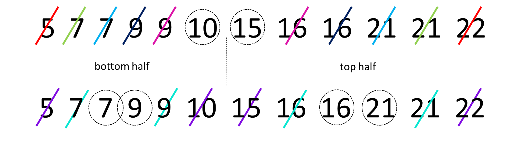
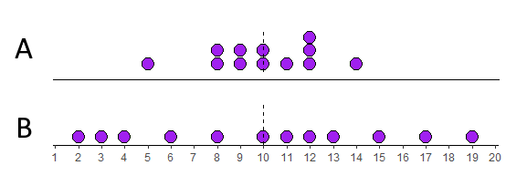

# Descriptives

Descriptive statistics describe basic features of the data in simple summaries. Examples include reporting measures of **central tendency** such as the mean, median, and mode. These are values that represent the most typical or most central point of a data distribution. Another class of descriptives are measures of **variability** or **variation** such as variance, standard deviation, ranges or interquartile ranges. These measures describe the spread of data. As well as being useful summaries in their own right, descirptive statistics are also used in data visualization to summarize distributions. There are several functions in R and other packages that help to get descriptive statistics from data. Before we go into detail about how to use R to get descriptives, we'll describe these measures of central tendency and variation in a bit more detail.


## Sample vs Population

The first thing we would like to discuss is the difference between **samples** and **populations**.  We can calculate descriptive measures such as means and standard deviations for both samples and populations, but we use different notation to describe these.  A population is all subjects that we could possibly collect data from. For example, if we were interested in the IQ scores of eighth graders in Texas, then our population of interest is all eighth graders in Texas. If we wished to study maze learning in juvenile rats, then our population of interest would be all juvenile rats. If we were studying leaf growth in sunflowers, then our population of interest is all sunflowers.  If we were able to measure the size of leaves on all sunflowers in existence, or measure the maze learning of all juvenile rats in the world, or the IQ of all eighth graders in Texas, then we would have data for the whole population. We would then be able to say something about the mean or median or some other descriptive about the population. Clearly, it is not always possible to measure every subject in a population. Of our three examples, it may just about be possible to measure the IQ of all Texas eighth graders although it would be a lot of work. It seems unlikely to be possible to measure the leaf growth of all sunflowers or the maze learning of all juvenile rats. Instead, what we typically do is to collect data on a subset of subjects. We call this subset a **sample**.   For instance, if we picked 10 sunflowers then we would collect data on just those sunflowers. We may be able to calculate the average leaf size of these 10 sunflowers and use that to **estimate** what the true leaf size is of all sunflowers.  We call the descriptive measures of samples **estimates** or **statistics**, whereas the descriptive measures of populations are called **parameters**.

Let's now discuss different descriptive measures in turn.


## Sample and Population Size

This isn't strictly a descriptive measure - but it is worth pointing out that the notation for the size of your data is different depending upon whether you are talking about a sample of a population.  If you are taking about a sample, then we use the lower case $n$ to refer to the sample size.  So, if you see $n=10$ this means that the sample size is 10. e.g. you picked 10 sunflowers to collect data on.  If you see the upper case $N$ this refers to the population size. So if you see that the population size is $N=1200000$ this refers to a population size of 1.2 million.


## Central Tendency

The first class of descriptives we will explore are measures of central tendency. These can be thought of as values that describe what is the most common, most typical or most average value in a distribution. Also, here we are using the term **distribution** to refer to a group of numbers or our data.

We'll use the following dataset as an example. Let's imagine that this is a sample of data:

```{r}
x <- c(1, 14, 12, 5, 3, 6, 11, 15, 9, 5, 4, 2, 7, 5, 3, 8, 11)
x
```

We can calculate the sample size using `length()`:

```{r}
length(x)
```

We can see that the sample size is $n=17$.


### Mode

The **mode** or **modal value** of a distribution is the most frequent or most common value in a distribution. The number that appears the most times in our sample of data above is `5`. The mode is therefore 5.  In our example, it's possible to manually check all the values, but a quicker way to summarize the frequency count of each value in a vector in R is to use `table()` like this:

```{r}
table(x)
```

We can see that there are 3 instances of the number 5 making it the mode.  There are two instances of 11 and 3, and every other number in the distribution has only 1 instance.

Is 5 really the 'middle' of this distribution though? The mode has some serious deficiencies as a measure of central tendency in that although it picks up on the most frequent value, that value isn't necessarily the most central measure.


### Median

The median value is the **middle** value of the distribution. It represents the value at which 50% of the data lies above the median, and 50% lies below the data.

One way to look at this is to visualize our distribution as a dot plot:


We have 17 datapoints, which is an odd number. In this case, we want the number/dot at which half the remaining datapoints (8) are below the median, and half (the other 8) are above the median. You can see in the image, that the median value is therefore 6. This leaves 8 dots below it and 8 dots above it.

To do this by hand, we would first order the data, and then work from the outside to the inside of the distribution, crossing off one from each end at a time. The image below shows how we're doing that using different colors to show the crossing out:


In R, we have a quick shortcut for calculating the median, and it's to use the function called `median()`:

```{r}
median(x)
```


If we have an even number of values in our distribution, then we take the average of the middle two values. For example, look at the image below. It has 12 numbers in the distribution, so we take the average of the 6th and 7th number:


Once we've crossed out each number going from outside to in, we're left with the 6th and 7th numbers being 10 and 15. The average of these numbers is 12.5, so the median is 12.5.  We can see that with `median()`:

```{r}
y <- c(5,7,7,9,9,10,15,16,16,21,21,22)
median(y)
```


### Mean

The mean, or **arithmetic mean** is the measure that most people think about when they think of the *average* value in a dataset or distribution. There are actually various different ways of calculating means, so the one that we will focus on is called the arithmetic mean. This is calculated by adding up all the numbers in a distribution and then dividing by the number of datapoints.  You can write this as a formula. For a sample, it looks like this:

$\overline{x} = \frac{\Sigma{x}}{n}$


And for a population it looks like this:  


$\mu = \frac{\Sigma{x}}{N}$

Notice that we use $\overline{x}$ to denote the mean of a sample, and $\mu$ to denote the mean of a population. Despite these notational differences, the formula is essentially exactly the same.


Let's calculate the arithmetic mean of our distribution `x`:


```{r}

sum_of_x <- 1 + 14 + 12 + 5 + 3 + 6 + 11 + 15 + 9 + 5 + 4 + 2 + 7 + 5 + 3 + 8 + 11

sum_of_x

```

So, here $\Sigma{x}=121$.  That makes the mean:

```{r}
sum_of_x / 17
```

This makes the mean $\overline{x}=7.12$.  The shortcut way of doing this in R, is to use the function `mean()`:

```{r}
mean(x)
```

We'll talk more about the pros and cons of the mean and median in future chapters.


## Variation

As well as describing the central tendency of data distributions, the other key way in which we should describe a distribution is to summarize the **variation** in data. This family of measures look at how much **spread** there is in the data. Another way of thinking about this is that these measure give us a sense of how *clumped* or how *spread out* the data are.


### Range

The simplest measure of spread is the **range**. This simply is the difference between the minimum and maximum value in a dataset. Looking at our distribution `x`, the minimum value is 1, and the maximum value is 15 - therefore the range is $15-1 = 14$.


The problem with range as a measure can be illustrated by just adjusting our data distribution slightly. Say, instead of having a datapoint at 15, we had a value at 25.  Now the range is 24 instead of 14. This suggests that the data is much more spread out, but in reality it is just one datapoint that is forcing the range to be much higher - the rest of the data is no more clumped or spread out.  This is the major drawback of the range - it can be easily influenced by outliers - as illustrated below.


In R, we can calculate the minimum, maximum and range of a distribution using the functions `min()`, `max()` and `range()`. Although `range()` just gives us the minimum and maximum values, we have to do the rest:

```{r}
min(x)
max(x)
range(x)
```


### Interquartile Range

The interquartile range or IQR is another measure of spread. It is roughly equivalent to the range of the middle 50% of the data.  One way to think about this is to consider how the median splits the data into a bottom half and a top half. Then, calculate the median of the lower half of the data and the median of the upper half of the data. These values can be considered to be the lower quartile and upper quartile respectively. The interquartile range is the difference between these values.  A visualization of this is below:


The median of the bottom half of our data is 3.5 (the average of 3 and 4). The median of the top half is 11 (the average of 11 and 11). This makes the IQR equal to $11-3.5 = 7.5$.


If we start with an even number of numbers in our distribution, then we include each of the middle numbers in their respective lower and upper halfs.  The image below represents this:



With this distribution, we calculated the median to be 12.5 as the numbers 10 and 15th were the middle two values. Because of this, we include 10 in the bottom half and 15 in the top half. When we work out to in on each of these halves, we find that the median of the bottom half is 8 (the average of 7 and 9) and the median of the upper half is 18.5 (the average of 16 and 21). Therefore, the lower quartile is 8 and the upper quartile is 18.5, making the IQR equal to $18.5-8=10.5$.


The above explanation of how to calculate the IQR is actually just one way of trying to estimate the "middle 50%" of the data. With this way of doing it, the lower quartile represents the 25% percentile of the data (25% of values being lower than it and 75% of values being higher). The upper quartile represents the 75% percentile of the data (75% of values being lower than it and 25% being higher).

Unfortunately, there are several ways of calculating the lower and upper quartiles and estimating where these 25% and 75% percentiles are. When we calculate them in R, the default method it uses is actually different to our 'by hand' method. To calculate quartiles, we use the function `quantile()` (note - not quartile!) but we have to put a second argument to say if we want the lower quartile or upper quartile.


```{r}
quantile(x, 0.25) #0.25 means lower quartile
quantile(x, 0.75) #0.75 means upper quartile
```

You can see these values are slightly different to our 'by hand' method. The upper quartile of `x` agrees with our method being 11. By hand we got the lower quartile to be 3.5, but R gives it as 4. This would make the IQR equal to $11-4 =7$. The quick way of getting that in R is to use `IQR()`:

```{r}
IQR(x)
```


We recommend using the R functions to calculate quartiles and interquartile ranges - it is a slightly stronger method than our by-hand method. You can actually do the by-hand method in R by adding `type=6` to the functions. There are actually nine different ways of calculating these in R - which is ridiculous!

```{r}
quantile(x, 0.25, type = 6)
quantile(x, 0.75, type = 6)
IQR(x, type = 6)
```


### Average Deviation

An alternative way of looking at spread is to ask how far from the center of the data distribution (i.e. the mean) is each datapoint on average. Distributions that are highly clumped will have most datapoints very close to the distribution's mean. Distributions that are spread out will have several datapoints that are far away from the mean.

Look at the two distributions below. Both of them have means of 10. The top distribution (A) however is much more clumped than the bottom distribution (B) which is more spread out.



Let's look at these in more detail. We'll start with distribution A.  We can calculate the difference of each datapoint from the mean (10) like this:

```{r}
A <- c(5,8,8,9,9,10,10,11,12,12,12,14)
A - mean(A)
```

If we add up all of those differences from the mean, then they will equal 0. We can show this like this:

```{r}
sum(A - mean(A))
```

A way to count up all the differences from the mean and to make sure that they count is to make each number positive regardless of its sign. We can do this using `abs()` in R:

```{r}
abs(A - mean(A))
```

When we sum all of these values up, we get the total of all the differences from the mean of each datapoint:

```{r}
sum(abs(A - mean(A)))
```

We see that this total is 22.  In formula notation, we find that $\Sigma|(x - \overline{\mu})|$. Here $x$ represents each datapoint. $\overline{\mu}$ represents the population mean. $| |$ represents 'take the absolute values of', and $\Sigma$ means "sum up".

To get the "average deviation" we simply divide our sum of difference scores by the number of datapoints, which is 12 in this case.  The formula for average deviation is:


$AD = \frac{\Sigma|(x - \overline{\mu})|}{N}$

```{r}
22/12
```

Our average deviation is therefore 1.83.  This can be interpreted as each datapoint being on average 1.83 units away from the mean of 10.


Another way to have got the $N$ would have been to use `length()` which counts the number of datapoints:

```{r}
sum(abs(A - mean(A))) / length(A)
```


We could do the same for distribution B. Calculate the sum of all the difference scores, and then divide by the $N$:

```{r}
B <- c(2,3,4,6,8,10,11,12,13,15,17,19)

#difference scores
B - mean(B)

# absolute difference scores
abs(B - mean(B))

# sum of absolute difference scores
sum(abs(B - mean(B)))

# average deviation
sum(abs(B - mean(B))) / length(B)
```

Here, the total sum of differences from the mean is 54. The average deviation is 4.5.  This value being higher than 1.83, shows that distribution B is more spread out than distribution A, which makes sense just looking at the dotplots of the data.


### Standard Deviation

An alternative, and much more common method of calculating the 'deviation' from the mean of the average datapoint is the standard deviation. This is very similar to the absolute deviation, but the method of making the difference scores positive is different. In average deviation, we just ignore the sign of the difference scores and we make everything positive (this is called taking the absolute value). In standard deviation the method used to make these difference scores positive is to square them.


Let's look at how this one works for our two distributions. We'll start with distribution A again.

First step, is again to get the difference scores, by taking each datapoint away from the mean of the distribution:

```{r}
A - mean(A)
```


Next, we square these difference scores to get positive values:

```{r}
(A - mean(A))^2
```

Notice that the datapoints that are furthest from the mean get proportionally larger than values that are close to the mean. Squaring has this effect.


We need to sum these "squared differences" to get a measure of how much deviation there is in total:

```{r}
sum((A - mean(A))^2)
```

The total of the squared differences is 64. The notation for this is:

$\Sigma(x-\mu)^2)$


To get a sense of the average squared difference, we then divide the total of the squared differences by our $N$:

```{r}
sum((A - mean(A))^2) / 12
```

The average squared difference is 5.33. The notation for this is $\frac{\Sigma(x-\mu)^2)}{N}$.

This is a useful measure of deviation, but unfortunately it is still in the units of "squared differences". To get it back to the original units of the distribution we just square root it and we call this the "standard deviation":

```{r}
sqrt(5.333333) 
```

The standard deviation is 2.309.  The notation for this is:

$\sigma = \sqrt{\frac{\Sigma(x-\mu)^2)}{N}}$

We are using $\sigma$ to represent the **population standard deviation**.


We can do the same thing for our population B. Let's calculate the difference scores, then square them, then add them up, then divide by $N$, and finally square root:

```{r}
# difference scores
B - mean(B)

# squared difference scores
(B - mean(B))^2

# Sum of squared differences
sum((B - mean(B))^2)

# Average squared difference
sum((B - mean(B))^2) / 12

# Standard Deviation
sqrt(sum((B - mean(B))^2) / 12)

```

The population standard deviation $\sigma$ for population B is 5.31. Again, as this value is higher than 2.31 this suggests that population B is more spread out than population A, because its datapoints are on average further from the mean.


### Variance

Variance is related to standard deviation. In fact, it is just standard deviation squared. It can be calculated by the formula:

$\sigma^2 = \sigma^2$

which is a bit ridiculous. Variance is denoted by $\sigma^2$ and is calculated by squaring the standard deviation $\sigma$.

It's actually the value you get before you do the square root step when calculating standard deviation. Therefore, we can actually say:


$\sigma^2 = \frac{\Sigma(x-\mu)^2)}{N}$


### Average versus Standard Deviation

So why do we have two methods for calculating the deviation from the mean. We have the "average devation" and the "standard deviation".  One thing you should notice is that the standard deviation is larger than the average deviation.  Distribution A had an average deviation of 4.5 and a standard deviation of 5.3.  Distibution B had an average deviation of 1.83 and a standard deviation of 2.3.  The reason for this is that squaring difference scores leads to larger values than just taking absolute values.  So why do we do the squaring thing?  The main reason is that it emphasizes datapoints that are further away from the mean, and this can be an important aspect of spread that we need to take account for. Because of that, it is favored to use the 'standard deviation' above the 'average deviation'.


### Sample versus Population Standard Deviation


## Comparing population and sample means

Why we need the sample standard deviation. 

The sample SD is an estimate of the population SD. We need this estimate because we never have data from the full population but only random samples. 

The formula for population sd is the square root of the variance divided by N, where are the sample sd is the square root of the variance divided by n -1. 


```{r}
x <- c(14, 11, 5, 3, 8, 10, 9, 15)

pop.sd(x) 

sd(x) 
```
The is a .3 difference if the standard deviations. However, would the difference be as big with a bigger sample?

```{r}
set.seed(1) # just so we all get the same results

x <- rnorm(100, mean = 8) #100 random numbers with mean of 8.

pop.sd(x) 

sd(x)      
```

Sample SD is larger than population SD but this difference gets smaller as sample sizes increase.

For visual proof that using the population SD underestimates for samples. 

For the example say we have a population of 1000, with a mean of 199.91 and population SD of 8.28.

```{r}
set.seed(1)
population <- rnorm(1000, mean = 200, sd = 8)

mean(population)  #199.91
pop.sd(population)    #8.28
```

What if you did not know the real population SD and you were going to take samples of size 15 to try and estimate the population mean and SD. 

```{r}
s1 <- sample(population, 15, replace = T)

mean(s1) 

pop.sd(s1)  

sd(s1)   
```

Let's try another sample:

```{r}
s2 <- sample(population, 15, replace = T)

mean(s2) 

pop.sd(s2)  

sd(s2)   
```

So, in one sample the sample SD was closer to the real pop SD in the other, the popSD was closer to the real pop SD.

---- 

Now let's do this for 10,000 samples:

```{r}
results.means<- vector('list',10000)
results.popSD<- vector('list',10000)
results.sampSD<- vector('list',10000)

for(i in 1:10000){
  s <- sample(population, 15, replace = T)
  results.means[[i]] <- mean(s)
  results.popSD[[i]] <- pop.sd(s)
  results.sampSD[[i]] <- sd(s)
}
```

Sample mean, remember the population mean = 199.91

```{r}
means <- unlist(results.means) # sample means

mean(means) 
```

Standard deviations using the population SD
```{r}
popSDs <- unlist(results.popSD) # SDs using popSD

mean(popSDs)
```

Sample SDs
```{r}
sampSDs <- unlist(results.sampSD) # sample SDs

mean(sampSDs)
```

Now graph everything!


This shows the sample mean is a good etimate of the population mean, on average. 
```{r}
ggplot(data.frame(means), aes(x=means)) +
  geom_histogram(color='black', fill='blue', alpha=.2)+
  theme_classic() +
  geom_vline(xintercept = mean(means), lwd=1, color="black") +
  geom_vline(xintercept = 199.91, lwd=1, color="orange", lty=2) +
  ggtitle("Sample Means Distribution")
```

However, this shows the population SD formula with samples, leads us to underestimating the real population SD - on average there is a lot of variation though.

```{r}
ggplot(data.frame(sampSDs), aes(x=sampSDs)) +
  geom_histogram(color='black', fill='blue', alpha=.2)+
  theme_classic() +
  geom_vline(xintercept = mean(sampSDs), lwd=1, color="black") +
  geom_vline(xintercept = 8.28, lwd=1, color="orange", lty=2) +
  ggtitle("SD Distribution when using Sample SD")
```

Overall, using the sample SD formula with samples, provides a better estimate of the population SD on average. This is why we divided by n-1 for sample SD.


## Descriptive Statistics in R

quick summary using real data...


```{r message=FALSE}
library(tidyverse)

atx <- read_csv("data/austin_weather.csv")

head(atx) # first 6 rows
```

Focus in the temperature column for now

```{r}
ggplot(atx, aes(x= temp)) + 
  geom_histogram(color="black", fill="lightseagreen", binwidth = 10)+
  theme_classic()
```


## Basic Descriptives
```{r}
length(atx$temp) # length this tells you the 'n'

sum(atx$temp) # sum

range(atx$temp) # range 

min(atx$temp) # minimum

max(atx$temp) # maximum

var(atx$temp) # variance 

```


## Mean, Median, and Mode 

```{r}
mean(atx$temp) # mean

sum(atx$temp)/length(atx$temp) # mean

median(atx$temp) # median

#estimate mode function 
estimate_mode <- function(x) {
  d <- density(x)
  d$x[which.max(d$y)]
}  

estimate_mode(atx$temp) # using the function to get estimate mode
```

For some descriptives, like mode, there is not a function already built into R, so a function needs to be made. The above code has a function for the estimated mode, this function works best with large data sets. 


``` {r}
sd(atx$temp) #  sample standard deviation

#population standard deviation function 
 pop.sd <- function(s) { 
   sqrt(sum((s - mean(s))^2)/length(s)) 
 } 

pop.sd(atx$temp) # population standard deviation with the function 
```


``` {r}
quantile(atx$temp, .25)  # this is the lower quartile

quantile(atx$temp, .75)  # this is the upper quartile

IQR(atx$temp)   # this is the inter-quartile range.

```

Don't be worried if these quartiles are slightly different to what you'd get by hand.

```{r}
ggplot(atx, aes(y=temp)) + 
  geom_boxplot(color='black', fill='lightseagreen')
```

nb we get those numbers on the x-axis because there is no 'group'
we can get rid of them like this:

```{r}
ggplot(atx, aes(y=temp)) + 
  geom_boxplot(color='black', fill='lightseagreen') + 
  scale_x_discrete(breaks = NULL)
```

## Descriptives for Groups
 
Often in experiments you are looking for group differences, the following code will show you how to get descriptive statistics for each group. 

This is a time where `tidyverse` comes in handy!

First read in the data and notice it has a group column, genre. 

```{r message=FALSE}
vg <- read_csv("data/videogames.csv")

head(vg)
```

The function `table()` can show you the n for all groups. 
```{r}
table(vg$genre)
```

Using `describeBy()` from the `psych` package can be a very quick and easy, but a bit annoying to look at. It also ignores missing data which is helpful.

* remember to install the `psych` package before using it. 


```{r, eval=FALSE}
library(psych)  ## this is not working on my computer

describeBy(vg, group = "genre")
```

Writing code using `tidyverse` can give us descriptive statistics in a more organized way. 

```{r}
vg %>% 
  group_by(genre) %>% 
  summarise(meanNA = mean(NA_sales))

```

If you had missing data, you'd do it like this. Also, `as.data.frame()` just helps us see decimal places. 


```{r}
vg %>% 
  group_by(genre) %>% 
  summarise(meanNA = mean(NA_sales, na.rm = T)) %>% 
  as.data.frame()
```

You can do several summaries at once like this

```{r}
vg %>% 
  group_by(genre) %>% 
  summarise(meanNA = mean(NA_sales),
            sd_NA = sd(NA_sales),
            meanEU = mean(EU_sales),
            sd_EU = sd(EU_sales)) %>% 
  as.data.frame()
```

To save time, you can tell it to just get the summary of all numeric columns. 

```{r}
vg$year <- as.factor(vg$year) # just need to make year non-numeric first


vg %>%
  group_by(genre) %>%
  summarise_if(is.numeric, mean, na.rm = T) %>%
  as.data.frame()


 vg %>%
  group_by(genre) %>%
  summarise_if(is.numeric, sd, na.rm = TRUE) %>%
  as.data.frame()

```

