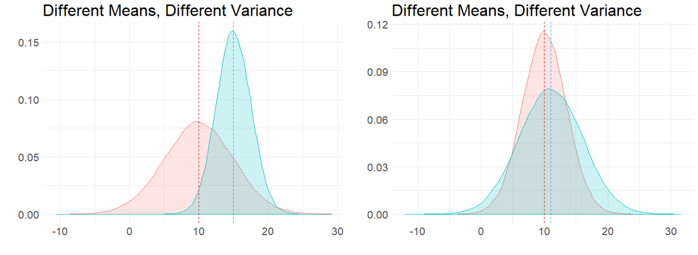

# Inferential Stats

blah

## Comparing two Samples

blah

blah

blah

## Independent Samples t-test

types

## Background to Student's 2 Sample t-test

blah

## Sampling Distribution of the Difference in Sample Means

blah

## Pooled Standard Deviation

blah

## Confidence Interval for Difference in Means

blah

## Conducting Student t-test

blah

## Doing Student t-test in R

blah

## Effect Sizes

Just because you observe a “significant” difference in means between two groups doesn’t mean that it’s interesting or relevant….  

i.e. being ‘significantly different’ doesn’t tell you how *BIG* the difference is – i.e. how *LARGE* the effect size is.

The formula for Cohen's $\delta$ is as follows:

$\Huge \delta = \frac{\overline{X}_{1} - \overline{X}_{2}}{\hat{\sigma}_{\rho}}$

## Paired t-tests

more sections to add...
