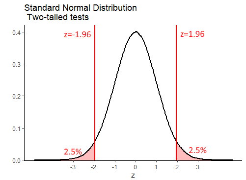

# One Sample Inferential Statistics


The general question at hand with one-sample inferential tests, is that we wish to test the probability that  our one sample of data comes from a population that has a true population mean $\mu$ that is equal to, greater than, or less than, some specific value.


## One-sample Z-tests


### Sampling Distribution Recap

In one-sample z-tests we are provided with the population mean $\mu$ and standard deviation $\sigma$. We then collect or are given one sample of data of size $n$. From this sample, we calculate the sample mean $\overline{x}$. The question then becomes, how likely were we to get a sample mean as large or as small as the sample that we got?

To answer this, we need to think in terms of the sampling distribution of sample means. We need to recognize that our one observed sample mean $\overline{x}$ is just one sample mean that we could have got from a sampling distribution of sample means. 

For instance, look at the population below. This is a normally distributed population of IQ scores, with a population mean $\mu = 100$ and a population standard deviation $\sigma = 15$.


Let's take a sample of size $n=25$ from this population, round the individual scores to 1dp, and get the mean of the sample:

```{r}
set.seed(1)
samp1 <- round(rnorm(n=25, mean=100, sd=15),1)
samp1
mean(samp1)
```

Our one observed sample has a sample mean of $\overline{x}=102.5$


If we repeated this step and got a second sample of $n=25$, we could get another sample mean $\overline{x}$:

```{r}
samp2 <- round(rnorm(n=25, mean=100, sd=15),1)
samp2
mean(samp2)
```

This time the sample mean is $\overline{x}=100.5$.


If you remember back to section xxx.xxx, if we were to repeat this process thousands and thousands of times, we would get a **sampling distribution of sample means**. We could visualize all of our sample means from many thousands of samples in a histogram, which shows the shape of the sampling distribution:


Because of Central Limit Theorem (see section xxx.xxx) then this sampling distribution is normally distributed and it's mean $\mu_{\overline{x}}$ is equal to the population mean $\mu$. Therefore $\mu_{\overline{x}}=10.0$. We also know the standard deviation of this sampling distribution, also known as the **standard error** as it can be calculated by: $\sigma_{\overline{x}} = \frac{\sigma}{\sqrt{n}}$.  Therefore, the sampling distribution standard deviation is $\sigma_{\overline{x}}=3.0$:

```{r}
sem <- 15 / sqrt(25)
sem
```


Because this sampling distribution is normally distributed, we can determine how far away from the mean any sample mean is in terms of how many standard deviations from the mean they are.  For instance, our first sample we got a mean of  $\overline{x}=102.5$. How many sampling distribution standard deviations is this from the mean of the sampling distribution?  We can use an amended z-score formula (see section xxx.xxx) to determine this:

$z = \frac{\overline{x} - \mu_{\overline{x}}}{\sigma_{\overline{x}}}$

```{r}
(102.5 - 100.0) / 3


```

So, our sample mean of  $\overline{x}=102.5$ is 0.833 standard deviations above the mean.  Because our sampling distribution is normally distributed, then we can visualize how far above the mean this value is on the standard normal curve as well as on the sampling distribution:


If we were asked what proportion of sample means were at least as big as 102.5, then we'd be interested in knowning what proportion of sample means are to the right of the red lines above. We can calculate the area under a standard normal curve to the left of any `z` value in R using `pnorm()`:

```{r}
pnorm(0.833)
```

To find the proportion of the curve to the right of the red line (i.e. the proportion of sample means that are greater than 102.5), we just subtract this value from 1.

```{r}
1 - pnorm(0.833)

```

So 20.2% of samples have a sample mean greater than 102.5.  In this situation, our one sample mean was not therefore that unusual or surprising.


### Calculating p-values for z-test

**One-tailed tests** 

We can calculate the proportion of sample means that are greater or less than any value.  For instance, if we were interested in whether a new reading program in a school boosted the IQ of subjects. We might take a sample of 25 of these students and measure their IQ.  If we got a sample mean of $\overline_{x} = 105.7$, we may wish to test whether this value is surprsingly large given that the population of IQ has a $\mu=100.0$ and $\sigma=15.0$.

If we were to formally write this in hypothesis terms, it would look like this:

$H_{0}: \mu \le 100.0$
$H_{1}: \mu > 100.0$

This is saying that the alternative hypothesis $H_{1}$ is that our sample of 25 come from a population whose mean is greater than 100.0.  The null hypothesis that we are testing is that they come from a population whose mean is equal to or less than 100.0.

For the test, we assume with the null hypothesis that our sample did indeed come from a population with  $\mu=100.0$ and $\sigma=15.0$. We already calculated above that the sampling distribution of sample means for $n=25$ has a $\mu_{\overline{x}}=100.0$ and $\sigma_{\overline{x}}=3.0$. How unusual is our one observed sample mean of $\overline{x}=105.7$?  We need to calculate this in terms of z:

$z = \frac{\overline{x} - \mu_{\overline{x}}}{\sigma_{\overline{x}}}$

```{r}
(105.7 - 100.0) / 3

```

This suggests that our observed sample mean is 1.9 sampling distribution standard deviations away from the mean of the sampling distribution.  We next need to work out what proportion of sample means are greater than this. That is akin to the red shaded area below:


We can do this with `pnorm()`:

```{r}
1 - pnorm(1.9)

```

This shows that only 2.9% of sample means are greater than our observed sample mean, given the population data of $\mu=100.0$ and $\sigma=15.0$. Therefore, our observed sample mean is quite surprising. We can write the likelihood of getting this sample mean as `p = 0.029`. Because we a priori had a prediction as to the direction of the mean in our sample (we predicted it to be higher than the population mean of 100.0), then we have in fact just done a one-tailed test. If we decide that any p-values that are below `p=0.05` are 'significant', then we can say that our reading program in the school has a 'signficant effect' on improving IQ scores.  


**Two-tailed tests** 

What instead we had implement a reading program that was quite radical, and we were not sure whether it would be successful or not. We were interested in seeing whether it could increase or decrease IQ?  In this situation, we do not have a direction of prediction, and we set up our hypotheses slightly differently:


$H_{0}: \mu = 100.0$
$H_{1}: \mu \ne 100.0$

Here, we are interested in whether our observed sample mean of $\mu=105.7$ could have come from a sampling distribution with a population mean of $\mu_{\overline{x}=100.0} or not.  The initial steps are the same. We calculate how unusual our observed sample mean was in terms of standard deviations away from the mean of the sampling distribution:


```{r}
(105.7 - 100.0) / 3

```


It's still 1.9 standard deviations away.

What we have to now thing about, is that because we did not predict the direction of the difference, we have to double our p-value. This is to account for the fact that in terms of 'surprising' results, we are interested in results that are more extreme than 1.9 standard deviations either side of the mean - i.e. the sum of the shaded area below:


Therefore, our p-value for this test is:

```{r}
2 * (1 - pnorm(1.9))
```

Which is `p=0.057`.  This would suggest that our reading program did not sufficiently shift the population IQ scores in our school away from 100.0, as our p-value is greater than 0.05.

But is this really true?   It is important to consider two things here.  One, it is important what initial hypothesis that you set up. If you have a strong a priori belief in the directionality of the hypothesis, then you are justified in doing a one-tailed z-test and using that p-value from that.  Secondly, the difference between `p=0.029` and `p=0.057` in this case isn't that great. We shouldn't be overly focused on the cut-off value of `p=0.05` as the criteria as to whether our results are significant or not significant. We should see the bigger picture, that our p-value is just one piece of information as to how different our sample of data is from the population that we believe it came from.


### Using critical values

In the preceding section, we ran one-tailed and two-tailed z-tests and calculated exact p-values. It is reasonably straightforward to do this in R. There is no reason not to use that approach. We prefer it. However, most often in introductory textbooks, a different approach is used. In this approach, the step of calculating the p-value is missed out. Instead, you are asked to just determine whether your obseved z-value is more extreme than you'd expect by chance.  "By chance" in this context means, that your observed z-value is less than 5% likely to occur.


**One-tailed z-test**

The population mean for SAT scores is $\mu=500$ with a population standard deviation $\sigma=100$. A tutoring company says that they improve SAT scores. A random sample of 12 students who took the tutoring program had a sample mean of $\overline(x)=551$. Let's test whether this sample mean came from the population.


$H_{0}: \mu \le 500.0$
$H_{1}: \mu > 500.0$


Next, we calculate the mean and standard deviation of the sampling distribution for a sample size $n=12$.  For the test, we assume that the sampling distribution mean $\mu_{\overline{x}}=500.0$ - i.e. is the same as the population mean. The standard deviation of the sampling distribution $\sigma_{\overline{x}} = 28.87$:

```{r}
100 / sqrt(12)

```

Next, we work out how many sampling distribution standard deviations from the sampling distribution mean is our observed sample:

```{r}
(551 - 500) / 28.86751

```

This shows that our observed sample mean of $\overline{x}=551$ is 1.77 standard deviations above the mean of the sampling distribution. We could convert this to a p-value and calculate precisely how many sample means are larger than this in the sampling distribution. Instead, we'll take a different approach:


Because this sampling distribution is approximately normal, we can determine how many standard deviations above the mean you'd have to be to be larger than 95% of all samples.


It turns out that $z=1.645$ is the value of $z$ that leaves 5% in the right hand tail. Therefore, any value of $z$ greater than $z=1.645$ will be 'unusually' large and have a p-value of less than 0.05.  If we were dealing with sample means that were surprisingly small (so a one-tailed test where we are predicting that the sample mean comes from a population with a mean that is smaller than the population mean), then we are looking for $z$ values that are lower than $z=-1.645$. 

We can work out where these 'critical values' are in R using the `qnorm()` function:

```{r}
qnorm(0.95) # leaves 5% in right of tail
```


```{r}
qnorm(0.05) # leaves 5% in left of tail
```


If we get back to our observed $z$ value of $z=1.77$, we can overlay this over the graph above like this:


As you can see, our observed $z$ value is more extreme than the 'critical value' of $z=1.645$. We say that our observed value is therefore in the 'region of rejection' and we can therefore reject the null hypothesis with a p-value of $p<0.05$ and accept the alternate hypothesis that our sample comes from a population with a population mean that is greater than 500. In other words, the tutoring program appears to have a population mean of SAT scroes greater than 500.


**Two-tailed z-test**

With the one-tailed z-test, we see that our critical values of z are $z=1.645$ for situations in which we are testing whether our sample mean is unexpectedly large, or $z=-1.645$ for situations in which we are testing that our sample mean is unexpectedly small. In a two-tailed situation, we are testing whether our sample mean is unexpectedly large *or* small. Because we still want only 5% of sample means to be in this 'unexpectedly' large or small category, this time we need a value of $z$ that leaves a total of 5% in the ends of both tails of the normal distribution. This is the same as leaving 2.5% in each tail:



```{r}
qnorm(.975)  # leaves 2.5% in right tail

qnorm(.025)  # leaves 2.5% in left tail

```


Let's illustrate this a bit further with the following example.  Say we have a bakery that makes cupcakes. The population mean weight of cupcakes is $\mu=6.5$ ounces, with a standard deviation of $\sigma=0.15$ ounces. A customer wants to test if a new cupcake variety is heavier or lighter than 6.5 ounces. They purchase a random sample of 10 cupcakes and find that the sample mean is $\overline(x)=6.42$ ounces. 

If we were to conduct a two-tailed test, to test if the population mean that our sample come from is equal to 6.5 ounces or not,  then our hypotheses would be:


$H_{0}: \mu = 6.5$
$H_{1}: \mu \ne 6.5$


We need to calculate the z-score for our sample mean, to determine how many standard deviations of the sampling distribution it is away from the mean.

```{r}
sem <- 0.15 / sqrt(10)  #standard deviation of the sampling distribution

z <- (6.42 - 6.5) / sem  # how many SD away from the mean is our sample

z
```

We can overlay this observed value of $z$ onto our standard normal curve like this:


Our value of $z=-1.69$ is therefore not inside either of the regions of rejection. This means that we do not have sufficient evidence to reject the null hypothesis that our sample comes from a population with mean of equal to 6.5. 


## One-sample t-tests

As with confidence intervals based on the $z$-distribution (the standard normal curve), the major issue with z-tests is that they require you to know the population mean $\sigma$ to perform the calculations.  This is almost never the case - with exceptions like standardized tests including IQ and SAT that are designed to have specific means and standard deviations.  

If you wish to test whether your observed sample mean is likely or not to come from a population with a given mean, what approach should you take when you do not know $\sigma$?  As with confidence intervals, the approach we take is to use the $t$-distribution.


```{r}
### One-sample t-test - bit more on the theory


# We want to test if our data sample could have come from a population with a specific hypothesized mean, or if it was unlikely to have come from that population.

# We need to imagine that our data sample is just one data sample that we could have theoretically collected from the population with that hypothesized mean.

# Our sample mean is therefore one sample mean we could have got from a sampling distribution of sample means.

# that sampling distribution has a t-distribution shape

# the mean of that sampling distribution is the hypothesized population mean.

# we calculate how unlikely our sample mean was to get from that sampling distribution by calculating the t-statistic - a measure of how many SD our sample mean is from the mean of the sampling distribution.


# e.g. The population mean number of words spoken by two year olds by their 2nd birthday is 50 words and is normally distributed.  

# A researcher wanted to investigate if reading to children increases their word knowledge. They collected data from 12 children who were read to for at least two hours every day. These are the number of words spoken by the 12 children:

x <- c(45, 53, 71, 35, 51, 59, 49, 55, 78, 27, 66, 59)

x

mean(x)  # 54, which is higher than 50.
# but is it meaningfully higher?


## Null H0:  mu <= 50
## Alternative H1:  mu > 50


# Our sample mean is one sample mean that could have come from the sampling distribution of sample means.

# What shape is that sampling distribution?

# t-distribution with df  n-1
# mean of the distribution is hypothesized mean 50.
# sd of the distribution is sampleSD/sqrt(n)


# We can standardize this sampling distribution to a t-distribution with mean 0.

mean(x)  #54
sd(x)  #14.4

n <- length(x)
n


t <-  (mean(x) - 50) / (sd(x) / sqrt(n))  #50 is hypothesized mean

t #0.96


#visualize
ggplot(data.frame(x = c(-4, 4)), aes(x = x)) +
  stat_function(fun = dt, args = list(df = 11)) +
  xlab("t") +
  ggtitle("t-distribution for df = 11") +
  geom_vline(xintercept = t, color="orange", lwd=1)


# what proportion of curve is above t value ?

pt(t, df=11, lower.tail = FALSE)  # p value 1 tailed test - proportion above t
# 0.178

pt(t, df=11, lower.tail = TRUE) # proportion below t
# 0.822


t.test(x, mu = 50)  # two sided test

t.test(x, mu = 50, alternative = "greater")  # two sided test
```


```{r}
### One-sample t-test

# Dr Zeppo example data.

# Psychology Student scores:

zeppo <- c(50,60,60,64,66,66,67,69,70,74,76,76,77,79,79,79,81,82,82,89)

zeppo

length(zeppo)  # 20 - there are 20 students in the sample.

mean(zeppo)  # the mean of the sample is 72.3

sd(zeppo)  # the sample SD is 9.52

n <- length(zeppo)

n 

## 95% confidence interval of the population mean...

#  sample.mean +/-  t * (sampleSD / sqrt(n))

n-1   # degrees of freedom

qt(c(.025, .975), df=n-1)  #95% CI requires 2.5% in each tail

qt(c(.025, .975), df=19)  #

qt(.975, df=19)  # Bit easier to type

tval <- qt(.975, df=19)

tval


# So, CI is:
mean(zeppo) + tval * ( sd(zeppo) / sqrt(n)) # 76.76
mean(zeppo) - tval * ( sd(zeppo) / sqrt(n)) # 67.84


#### To run a one-sample t-test, comparing to some hypothesized mean

zeppo

t.test(zeppo, mu = 65.0)  # Default is a 2-tailed test.
# use this one to get the 95% CI


# you can do one-tailed test, with a predicted direction 
t.test(zeppo, mu = 65.0, alternative = "greater")  

t.test(zeppo, mu = 65.0, alternative = "less")  


shapiro.test(zeppo) # p>.05, so assume data approx normal


#### Example 2:

# On their second birthday, children know a mean of 50 words, and this is normally distributed.

# Researchers collected data from 12 children who were read to for >two hours per day.

# Did this sample of 12 children have a mean of greater than 50?


x <- c(45, 53, 71, 35, 51, 59, 49, 55, 78, 27, 66, 59)

x

shapiro.test(x) # p>.05, so assume approximately normal data.


t.test(x, mu = 50)  # two sided test

t.test(x, mu = 50, alternative = "greater")  # two sided test


#### Example 3:

# Data imported ...

library(tidyverse)

xt <- read_csv("data/crosstimes.csv")
xt


# one-tailed
# compare sample mean to hypothesized mean of 16.0
# for time3

xt$time3  # our sample data

mean(xt$time3)  # sample mean = 15.1

t.test(xt$time3, mu = 16.0) # this is 2-tailed - but has CI

t.test(xt$time3, mu = 16.0, alternative = "less") # this is 1-tailed


# assumption is that the data is normally distributed
shapiro.test(xt$time3)  # borderline


#### Worked Example - try for yourself...--------------

### Read in the Data BlueJays
jays <- read_csv("data/BlueJays.csv")

# just look at the females.
jaysF <- jays %>% filter(KnownSex == "F")
head(jaysF)

# 1. Is the variable "BillLength" approximately normal? Use a Shapiro-Test.

shapiro.test(jaysF$BillLength)


# 2. Use t-test, to 
# i)  Calculate a 95% CI of the female population BillLength mean
# ii) Test if the sample mean is meaningfully larger than 23.5mm

t.test(jaysF$BillLength, mu = 23.5)   # Confidence interval

t.test(jaysF$BillLength, mu = 23.5, alternative = "greater")   #t-test


```


