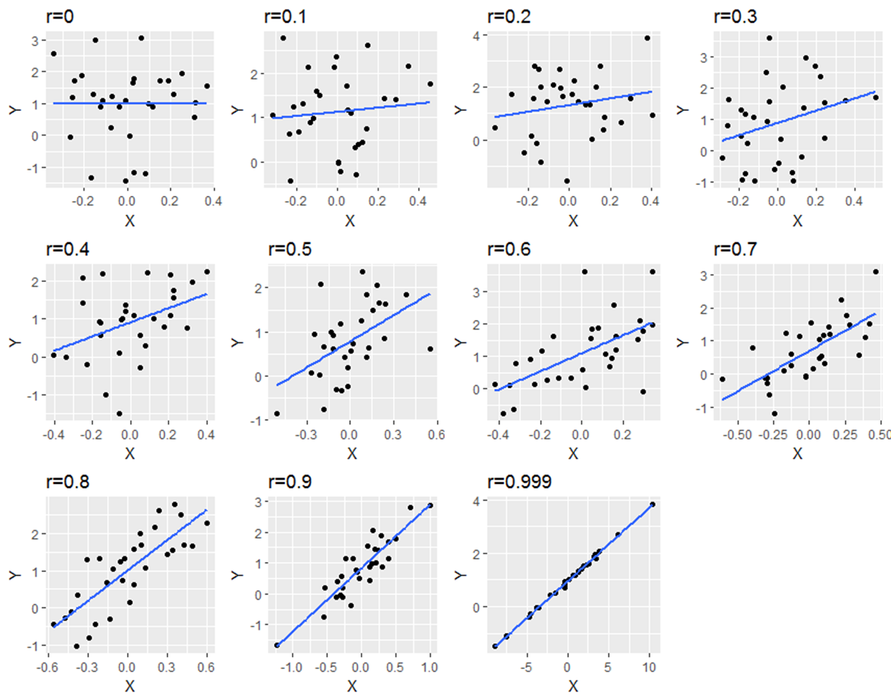

# Correlation


## Pearson Correlation

Pearson's correlation is measured by `r` and ranges between -1 and +1.  +1 indicates that the variables `X` and `Y` are maximally positively correlated, such that as values of X increase so do values of Y. -1 indicates a compleltely negative correlation such that as values of `X` increase, values of `Y` decrease.  A value of 0 indicates that there is no overall relationship.


The below image shows scatterplots, each with a sample size of 30. The trendline is to help demonstrate how correlations of different magnitudes look in terms of their association.




## Calculating the Pearson Correlation in R

To calculate the correlation coefficient in R, it's pretty straightforward.  You simply can use the `cor()` function. For instance, let's correlate...


```{r}
cor(1:10,1:10) # replace with an example
```


Before we go further into what we should do with these correlations, and how to signficance test them, let's learn a little bit more about how they come about.


## Cross-products

The formula for calculating the Pearson's correlation coefficient for a sample is:

$r = \frac{\sum_{}^{} z_{x}z_{y}}{n - 1}$


When we have a population, we can use the formula: 


$r = \frac{\sum_{}^{} z_{x}z_{y}}{N}$


Essentially, the steps are to convert all the `X` and `Y` scores into their respective z-scores. Then you mutliply these two values together to get the `cross-product`.  After summing up all the cross-products for each data point, we divide this number by `n-1` if we're dealing with a sample (we usually are), or `n` if we're dealing with a population.  The above formula is for a sample.

The sum of the cross-products will therefore be largely positive if positive z-scores are multiple together or if negative z-scores are multiplied together.  The sum of the cross-products will be largely negative if negative z-scores are multipled with positive z-scores.


The following example should help make this clearer.  Look at the following data, its  scatterplot and the correlation coefficient.  They show that we have a positive correlation of `r=0.84`.  Let's break it down how we got that value.

```{r}
x <- c(1.1, 1.5, 2.1, 3.5, 3.6, 3.5, 2.6, 5.6, 4.4, 3.9)
y <- c(2.8, 2.9, 1.6, 5.5, 4.7, 8.1, 3.3, 7.7, 7.1, 5.8)

df <- data.frame(x, y)

df

ggplot(df, aes(x = x, y = y)) + geom_point(size=2)

cor(x,y)
```

First, let's calculate the means and standard deviation (using `sd` so a sample standard deviation) of `x` and `y`.  We need to get these values so we can calculate the z-scores of each.

```{r}

# step 1:  Get the mean and sd of x and y


mean(x)
sd(x)

mean(y)
sd(y)
```


Now, we can calculate the z-scores, remembering that the formula for that is:  

$z = \frac{x - \overline{x}}{s_{x}}$

```{r}
# step 2. Calculate z-scores of x, and z-scores of y.

df$zx <- (x - mean(x)) / sd(x)  # z scores of x
df$zy <- (y - mean(y)) / sd(y)  # z scores of y

df

```


Following this, we simply multiple the z-scores of `x` and `y` against each other for every data point:

```{r}
# step 3. Calculate the cross-product:  zx * zy

df$zxzy <- df$zx * df$zy

df

```


We now have all of our cross-products.  Notice why the majority are positive. This is because we have multiplied positive $z_{x}$ with positive $z_{y}$ or we multiplied negative $z_{x}$ with negative $z_{y}$.  This happens because datapoints that tend to be above the mean for `x` are also above the mean for `y`, and points that are below the mean of `x` are also below the mean of `y`.  

We can add this up to get the sum of the cross-products.  That is the $\sum_{}^{} z_{x}z_{y}$ in the formula.

```{r}

# step 4.  Sum up the cross products.

sum(df$zxzy) # 7.58

```

We now divide that by `n-1` as we have a sample, to get the correlation coefficient `r`. That gives us an estimation of the average cross-product.


```{r}

# step 5- calculate 'r' by dividing by n-1. (for a sample)

sum(df$zxzy) / 9   # our n was 10, so n-1 = 9

sum(df$zxzy) / (nrow(df) - 1)  # nrow(df) is more generalizable

# r=0.84

```


Just as a quick second example, here is a work through calculating a negative correlation.  Notice the $z_{x}$ and   $z_{y}$ scores that are multiplied together.  They are largely opposite in terms of signs. This is what leads to a negative sum of cross-products and the negative correlation.  Why?  Because data points that are above the mean for `x` are generally below the mean in terms of `y` and visa-versa.


```{r}

### Example 2.   Negative Correlation.

x <- c(1.1, 1.5, 2.1, 3.5, 3.6, 3.5, 2.6, 5.6, 4.4, 3.9)
y <- c(10.4, 10.0, 8.4, 8.5, 8.4, 6.3, 7.1, 6.2, 8.1, 10.0)

df <- data.frame(x, y)

ggplot(df, aes(x = x, y = y)) + geom_point(size=2)


cor(df$x,df$y) 

```

Here is the code, truncated for space:


```{r}
# Calculate z-scores for each x and each y
df$zx <- (x - mean(x)) / sd(x)
df$zy <- (y - mean(y)) / sd(y)

# Calculate the cross-product:  zx * zy
df$zxzy <- df$zx * df$zy

# let's look at the dataframe
# notice the cross products:
df


# Sum up the cross products and Calculate 'r' by dividing by N-1.

sum(df$zxzy) / (nrow(df) - 1)


cor(df$x,df$y) 

```


## Conducting a Pearson Correlation Test


## Assumptions of Pearson's Correlation


## Alternatives to Pearson's Correlation