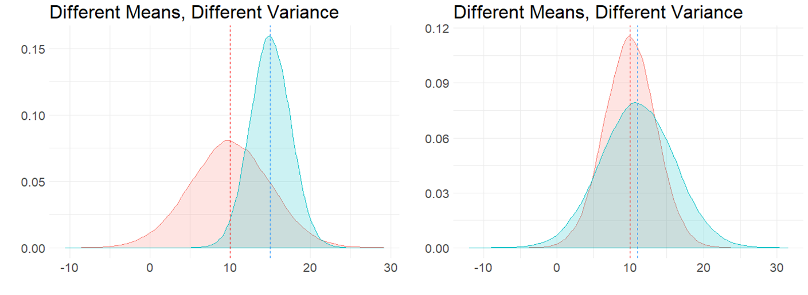

# Two Sample Inferential Statistics


blah

```{r}
library(tidyverse)
```

## Comparing two Samples

blah


blah



blah


## Independent Samples t-test

Gather data from two samples..... is there a difference between these samples in their means?  Well if they are samples, then there more than often will be a difference.  For instance, x x x x,. Only if their sample means were precisely the same is there no difference.   The more interesting bigger question is.... could these two indepednent samples theoretically have come from the same population... ie could we have taken our two samples at random from the same population..... or do we have sufficient evidence to suggest that they come from two separate populations that differ in their true population means.

focused on identifying if there is a difference in means between the populations.....  to do this.....

could get 95% CIs of each..... or a 95% CI of the difference in means from our one observed sample mean difference.... or run t-tests...

two types...
types
Welch's .... Student's.....


## Sampling Distribution of the Difference in Sample Means


For a two-sample $t$-test, the sampling distribution we use is different to the sampling distribution for a one-sample $t$-test. In a one-sample test, we are focused on the sampling distribution of sample means. In a two-sample test we are focused on the *sampling distribution of the differences in sample means*.


### Visualizing the Sampling Distribution


Let's try to illustrate this by looking at the sampling distributions we could get when we draw samples from two populations. In the first example, the populations differ in their means.  In the second example, the populations do not differ in their means.


** Difference in Population Means **

Say we have two normally distributed populations, A and B and each has 500,000 subjects. A has a population mean $\mu = 15$, and a population standard deviation $\sigma = 2.5$.  B has a population mean $\mu = 12$, and a population SD $\sigma = 2.5$.

We can generate these population by simulation in R like this:

```{r}
set.seed(1)

A <- rnorm(n = 500000, mean = 15, sd = 2.5)
B <- rnorm(n = 500000, mean = 12, sd = 2.5)

```


We can check their mean and standard deviation, and we see that the standard deviations are identical at 2.5, but the population means differ by 3:

```{r}
# and their summary descriptive stats
mean(A)   
sd(A)     

mean(B)   
sd(B)    

```


We can visualize these population distributions as follows:

```{r}
data.frame(A, B) %>%
  pivot_longer(1:2) %>%
  ggplot(aes(x=value, fill=name)) +
  geom_density(alpha = .1) +
  theme_classic() +
  ggtitle("Comparison of Population A vs B")+
  geom_vline(xintercept = 15, color="red", lwd=1, lty=1)+
  geom_vline(xintercept = 12, color="dodgerblue", lwd=1, lty=2) +
  scale_x_continuous(breaks = seq(2,26,2))
```


We can calculate the true difference in population means $\mu_{A} - \mu_{B}$ to be 2.997. 


```{r}
mean(A) - mean(B) 
```


If we knew nothing about the populations of A and B, but were interested in whether they differed in their population means, then we might take a sample of A and a sample of B and compare their sample means. In this example, we are going to take a sample of size $n=17$ from population A, and a sample of size $n=20$ from population B.  These sample sizes were picked more or less at random - they can be the same sized samples, or they can be different sizes. 

Let's take our samples, and then examine the differences in our sample means:

```{r}
set.seed(1) # so we get the same values

a1 <- sample(A, 17)
a1

b1 <- sample(B, 20)
b1

mean(a1)
mean(b1)

mean(a1) - mean(b1)  

```

Here we find that the difference in means between our sample from population A and our sample from population B is 2.85.  In other words, $\overline{x}_{A} - \overline{x}_{B} = 2.85$  This is pretty close to the true difference in population means (although we're currently pretending that we don't know that difference).


We could do this again. Let's select another sample from population A of size 17, and another sample from population B of size 20:


```{r}
a2 <- sample(A, 17)
a2

b2 <- sample(B, 20)
b2


mean(a2)
mean(b2)

mean(a2) - mean(b2)  

```

This time, $\overline{x}_{A} - \overline{x}_{B} = 3.37$  This is again pretty close to the true difference in population means, but a bit higher tis time.


We can keep drawing samples of size 17 from A, and size 20 from B and examining the difference in sample means $\overline{x}_{A} - \overline{x}_{B}$.  A quick way of writing that code in R is as follows - where we repeat it 5 more times:

```{r}
mean(sample(A,17)) - mean(sample(B,20))
mean(sample(A,17)) - mean(sample(B,20))
mean(sample(A,17)) - mean(sample(B,20))
mean(sample(A,17)) - mean(sample(B,20))
mean(sample(A,17)) - mean(sample(B,20))
```

As you can see, the values we get tend to be a little bit above or a little bit below 3.

If we did this thousands and thousands of times, we'd get a distribution of the differences in sample means. This would be the *sampling distribution of the differences in sample means*.  Below we repeat the above step 10,000 times to get a visualization of what this sampling distribution looks like:

```{r}
set.seed(1)
difs <- vector('list', 10000)

for(i in 1:10000){
  difs[[i]] <-  mean(sample(A, 17)) - mean(sample(B, 20))
}

df <- data.frame(dif = unlist(difs))


#get mean difference
mean(unlist(difs))  # 3.00

#make histogram
ggplot(df, aes(x=dif)) +
  geom_histogram(color='black', fill='dodgerblue', alpha=.5, binwidth = .1)+
  theme_classic() +
  xlab("Difference in Sample Means")+
  ggtitle("Sampling Distribution of Difference in Sample Means") +
  geom_vline(xintercept = mean(unlist(difs)), lwd=1, color="red")


```


As you can see, the sampling distribution is approximately symmetrical. If we ran it for more simulations, it would become even more symmetrical. The average (mean) difference in sample means across all samples is $\mu_{\overline{x}_{A} - \overline{x}_{B}}= 2.987$ which is approximately equal to the real difference in population means $\mu_{A} - \mu_{B}$.

An obvious next question is what is the standard deviation of this sampling distribution? i.e. the standard deviation of the sampling distribution of the differences in sample means. If we knew this, then we'd be able to describe how likely or unlikely we were to get any particular difference in sample means in terms of how many sampling distribution standard deviations that score is away from the mean.

There are actually two different formulas that we can use to work out the standard deviation - which we will discuss shortly (see section xx.xxx).  In brief, it is a bit trickier to calculate the standard deviation of this sampling distribution compared to the standard deviation of the sampling distribution of sample means, because our difference in sample means uses two different samples each with their own sample standard deviation. 

Given we just simulated our sampling distribution of the differences in sample means, we could just look at its standard deviation in R:

```{r}
sd(unlist(difs))
```

This tells us that the standard deviation of this sampling distribution is approximately equal to $\sigma_{\overline{x}_{A} - \overline{x}_{B}}= 0.82$.  As well as using the formulas that we will introduce shortly to estimate this value, there is actually another shortcut we could have used too as we know the original population standard deviations. This is not essential to know or remember, as it's not something we would ever do in practice, it's just something to point out in passing.

There is something called [variance sum law](http://onlinestatbook.com/2/summarizing_distributions/variance_sum_law.html).  Essentially, if you want to know the difference of two variables, then it is equal to the sum of the variance of the two variables.

Our variables in this scenario are the sampling distributions of sample means for A and B. We can calculate the variance of each by $\sigma^2/n$.  If we add them together according to the variance sum law, we get the variance for the difference in these two variables. Then we square-root to get the standard deviation - which is equivalent to our sampling distribution of the difference in sample means standard deviation:

```{r}
sqrt((var(A)/17) + (var(B)/20)) 
```

Again, this tells us that $\sigma_{\overline{x}_{A} - \overline{x}_{B}}= 0.82$.  

However, in practice, we only have our two samples (our one sample of population A and our one sample of population B). We don't know anything else about the sampling distribution or the populations. Therefore we cannot use either of the above methods to calculate the standard deviation of the sampling distribution.  We'll get to what method you need to use soon.  


** No Difference in Population Means **

Let's look at an example of what the sampling distribution of difference in sample means looks like when there is no difference between population means.

In this scenario, we have two normally distributed populations, C and D and each has 500,000 subjects. C has a population mean $\mu = 10$, and a population standard deviation $\sigma = 3$.  D has a population mean $\mu = 10$, and a population SD $\sigma = 3$. We can generate these populations in R:

```{r}
set.seed(1)

C <- rnorm(n = 500000, mean = 10, sd = 3)
D <- rnorm(n = 500000, mean = 10, sd = 3)

```


We can then examine their means and standard deviations:

```{r}
# and their summary descriptive stats
mean(C)   
sd(C)     

mean(D)   
sd(D)     
```


We can then calculate the true difference between these populations in their population means and see that $\mu_{C}-\mu_{D} = 0.00$ 

```{r}
mean(C) - mean(D)
```


We can also visualize these populations - it can be hard to see both populations because they are identical and D is directly on top of C, but they are both there!

```{r}
data.frame(C, D) %>%
  pivot_longer(1:2) %>%
  ggplot(aes(x=value, fill=name)) +
  geom_density(alpha = .1) +
  theme_classic() +
  ggtitle("Comparison of Population C vs D")+
  geom_vline(xintercept = 10, color="red", lwd=1, lty=1)+
  geom_vline(xintercept = 10, color="dodgerblue", lwd=1, lty=2)
```


For this example, let's look at one sample of size 11 for population C and one sample of size 14 for population D.

```{r}
set.seed(1)
c1 <- sample(C, 11)
d1 <- sample(D, 14)

c1
d1

mean(c1)

mean(d1)

mean(c1) - mean(d1)  
```

Here we find that the difference in sample means $\overline{x}_C - \overline{x}_D = -0.197$.

If we did this lots of times, we'd sometimes get sample means that were larger in C and sometimes they would be larger in D. Let's do it five more times:

```{r}
mean(sample(C,11)) - mean(sample(D,14))
mean(sample(C,11)) - mean(sample(D,14))
mean(sample(C,11)) - mean(sample(D,14))
mean(sample(C,11)) - mean(sample(D,14))
mean(sample(C,11)) - mean(sample(D,14))
```


If we did this thousands and thousands of times, we will get our sampling distribution of the differences in sample means. We can use the code below to simulate this, collecting 20,000 samples of C and D and determining the difference in means for each sample collected:

```{r}
set.seed(1)

difs1 <- vector('list', 20000)

for(i in 1:20000){
  difs1[[i]] <-  mean(sample(C, 11)) - mean(sample(D, 14))
}

```

We can visualize this sampling distribution:

```{r}
## plot as a histogram:
df1 <- data.frame(dif = unlist(difs1))

ggplot(df1, aes(x=dif)) +
  geom_histogram(color='black', fill='mistyrose', alpha=.5, binwidth = .2)+
  theme_classic() +
  ggtitle("Sampling Distribution of Difference in Sample Means") +
  geom_vline(xintercept = mean(unlist(difs1)), lwd=1, color="red")
```


```{r}
mean(unlist(difs1))  
```

After 20,000 samples of size 11 from population C and size 14 from population D, we find that the mean difference in sample means is $\mu_{\overline{x}_C - \overline{x}_D} = -0.006$. This is pretty close to the true difference in population means of 0. If we were to run our simulation for longer to get even more differences in sample means, then our mean difference would get even closer to 0.


So, we have a symmetrical sampling distribution of differences in sample means with a mean $\mu_{\overline{x}_C - \overline{x}_D}$ approximately equal to 0.0. What is the Standard Deviation of this distribution? Again, we can calculate this directly from our simulated data:

```{r}
sd(unlist(difs1))
```

Here we find that the standard deviation is $\sigma_{\overline{x}_C - \overline{x}_D} = 1.2$.  The question becomes, how do you estimate this standard deviation when you only have one sample of each population?  We shall get to how this is done in the next few sections.


## Pooled Standard Deviation


In the Student's t-test, we assume that our two samples come from populations that have "equal variance", i.e. that their standard deviations are equivalent. The reason behind this is that it enables us to use this estimate in calculating the Standard Deviation of the Sampling Distribution of Differences in Sample Means.  

When we assume that two samples have the same variance, we estimate this by pooling their standard deviations. Let's look in more detail about how standard deviations are pooled.


When we have two samples, they each have sample standard deviations, that are usually not equal. For example, let's look at these two samples. The first sample is of size 9 and the second sample is of size 10.

```{r}
samp1 <-  c(23, 25, 33, 19, 21, 27, 26, 31, 20)
samp1
sd(samp1)


samp2 <-  c(21, 22, 23, 19, 20, 24, 25, 21, 23, 22)
samp2
sd(samp2)

```


It's clear that our sample standard deviations differ, with sample 1 having a sample standard deviation $s=4.82$ and sample 2 having a sample standard deviation of $s=1.83$.

So, if we assumed that they both come from populations with the same SD, how do we estimate that value? We have to pool the standard devation.  Essentially, we want to calculate a value that is likely somewhere in between the two sample SDs. In practice we use a weighted average.

There are two ways of going about calculating this pooled standard deviation value.  The first is to use first principles as to what a standard deviation is. This is the one that makes most sense logically (to us at least), but it is also the more long-winded way.  The second way is to use a shortcut formula.


** Option 1: From first principles **

Let's first calculate the pooled standard deviation based on first principles.  Remember, a standard deviation is the square root of the average squared deviation of each value from the mean.

What we could do is to get the difference of every score from it's group mean, then square those differences, then add them all up, then divide by $n-2$, and then square root.  We divide by $n-2$ instead of $n-1$ because we have two samples that we are using and we are usings two different estimated means to determine the standard deviation. Therefore, to avoid underestimating our standard deviation we divide by $n-2$.

Here, we break this down step by step:

i) Calculate each sample mean:

```{r}
mean(samp1)
mean(samp2)

```

ii) Let's get the differences of each score from their group mean:

```{r}
# get the differences from each group mean:

samp1_dif  <- samp1 - mean(samp1)
samp2_dif  <- samp2 - mean(samp2)

samp1_dif

samp2_dif
```


iii) Now square all these differences:

```{r}
samp1_dif2 <- samp1_dif^2
samp2_dif2 <- samp2_dif^2

samp1_dif2
samp2_dif2
```

iv) Get the sum of all the squares and add them up across both samples:

```{r}
ssq <- sum(samp1_dif2) + sum(samp2_dif2)
ssq
```

v) Now we get the 'average' squared deviation by dividing by n-2

```{r}
n2 <- 9 + 10 - 2
asd <- ssq/n2
asd
```

vi) Finally, we get the pooled standard devation by squarerooting this:

```{r}
sqrt(asd)
```

Thus our estimate of the pooled standard deviation is $\hat\sigma_p = 3.56$.   This value is between our original sample standard deviations of 4.82 and 1.83, which makes sense.

You may see the following forumla for calculating the pooled standard deviation in the way we just did. 

$\hat\sigma_p = \sqrt{\frac{\Sigma_{ik}(x_{ik} - \overline{x}_k)^2}{n_1 + n_2 -2}} $


Here, $n_1$ is the sample size of sample 1, $n_2$ is the sample size of sample 2. The $\Sigma_{ik}(x_{ik} - \overline{x}_k)^2$ part of the formula is simply saying to take each data point away from it's sample mean and then square it - and then add all of these up. It looks quite intimidating, but hopefully the steps we outlined above make sense.


** Option 2: Using a shortcut formula **

The second way to calculate the pooled standard deviations doesn't require you to know the raw data. It is a formula that only requires you to know the sample standard deviation of each sample and the sample size of each sample. This is the formula:

$\hat\sigma_p = \sqrt{\frac{w_1s_1^2 + w_2s_2^2 }{w_1 + w_2}} $


Here, $w_1 = n_1-1$ where $n_1$ is the sample size of sample 1. $w_2 = n_2-1$ where $n_2$ is the sample size of sample 2. $s_1$ is the sample standard deviation of sample 1, and $s_1$ is the sample standard deviation of sample 2.

We can calculate the pooled standard deviation using this formula for our two samples above:

```{r}
s1sd <- sd(samp1)
s2sd <- sd(samp2)

w1 <- length(samp1) - 1
w2 <- length(samp2) - 1

numerator <- (w1*s1sd^2) + (w2*s2sd^2)
denominator <- w1+w2

sqrt(numerator/denominator) 

```

This approach also calculates the pooled standard deviation to be $\hat\sigma_p = 3.56$.


## Theory behind Student's t-test

Hopefully you have a sense of the sampling distribution for the difference in sample means, and an idea about what pooled standard deviation is.  In this section we'll bring together these ideas to show you the behind the scenes working of the Student's t-test.


We'll use some example data from [the Navarro book](https://learningstatisticswithr.com/book/ttest.html#studentttest). These data are the exam scores of students who were TA-ed by either Anastasia or Bernadette. The question at hand is whether these two samples could have come from populations with the same mean, or from populations with different means. We assume that the variance (and therefore standard deviations) of both of these populations are the same. 

Here are the data:

```{r}
anastasia <- c(65, 74, 73, 83, 76, 65, 86, 70, 80, 55, 78, 78, 90, 77, 68)
bernadette <- c(72, 66, 71, 66, 76, 69, 79, 73, 62, 69, 68, 60, 73, 68, 67, 74, 56, 74)

```


We can make a boxplot to compare the two samples:

```{r}
# plot the data:
d <- data.frame(values = c(anastasia, bernadette),
                group = c(rep("anastasia",15), rep("bernadette", 18))
)

ggplot(d, aes(x = group, y = values, fill = group)) +
  geom_boxplot(alpha=.3) +
  geom_jitter(width=.1, size=2) +
  theme_classic() +
  scale_fill_manual(values = c("firebrick", "dodgerblue"))

```


We can also get the sample mean $\overline{x}$, standard deviation $s$ and $n$ of each sample:

```{r}
mean(anastasia)            
sd(anastasia)              
nA<-length(anastasia)      
nA

mean(bernadette)           
sd(bernadette)             
nB <- length(bernadette)   
nB
```


Although we are actually interested in whether these two samples come from populations that differ in their population means, we can directly measure if the two samples differ in their sample means by subtracting one from the other:

```{r}
mean(anastasia)  - mean(bernadette)  
```

We can see that Anastasia students have on average 5.48 higher scores than Bernadette students. But how meaningful is this difference?


What we are going to do is to work out how unusual or usual our one observed sample mean difference is.  We need to construct the sampling distribution of differences in sample means. We hypothesise that the true mean difference in population means is 0 (no difference between groups).

These are our hypotheses:


$H_{0}: \mu_A = \mu_A$
$H_{1}: \mu_A \ne \mu_A$


If we assume that the true difference in population means is 0 (the null hypothesis), then this will mean that the mean of the sampling distribution of the difference in sample means will also be 0 ($\mu_{\overline{x}_A-\overline{x}_B}=0$). If we know the standard deviation of this sampling distribution, then we could work out how many standard deviations away our one observed sample mean differnce of 5.48 is from 0. That would enable us to work out the probability of getting a value that extreme.


So our next step is to work out the standard deviation of the sampling distribution. If we assume equal variances between the populations of group A and B, then we can calculate the standard deviation of this sampling distribution as

$\sigma_{\overline{x}_A-\overline{x}_B} = \hat\sigma_p \times \sqrt{\frac{1}{n_1} + \frac{1}{n_2} }$


So, the first step in this formula is to calculate the pooled standard deviation $\hat\sigma_p$.  We can either calculate this from first principles (see section xxx.xx) or using the shortcut formula (see section xxx.xxx). Below, we calculate the pooled standard deviation using the first principles:

```{r}
# from first principles, calculating deviations from each group mean
difA2 <- (anastasia - mean(anastasia))^2
difB2 <- (bernadette - mean(bernadette))^2
sumsq <- sum(difA2) + sum(difB2)
n <- nA + nB #33
sd.pool <- sqrt(sumsq/(n-2))

sd.pool # 7.41  this is the estimated pooled s.d.
```

This gives us a value of $\hat\sigma_p = 7.407$. This makes sense being in between our two sample standard deviations:

```{r}
sd(anastasia) #8.999
sd(bernadette) #5.775
```


Once we've calculated the pooled standard deviation $\hat\sigma_p$, we can insert it to the formula above to calculate the standard deviation of the sampling distribution of differences in sample means $\sigma_{\overline{x}_A-\overline{x}_B}$.

```{r}
sedm <-  sd.pool * sqrt( (1/nA) + (1/nB))

sedm  # this is the Standard Deviation of the Sampling Distribution of differences in sample means
```

Doing this, we calculate $\sigma_{\overline{x}_A-\overline{x}_B} = 2.59$.  This tells us that the standard deviation of the theoretical sampling distribution of the differences in sample means is 2.59. With that information, we can work out how many standard deviations away from the mean (of 0) our one observed difference in sample means of $\overline{x}_A - \overline{x}_B = 5.48$ is. 


Lets' visualize what this sampling distribution looks like:


By estimating the standard deviation, we are able to plot what our sampling distribution would look like. We are then able to see that our observed difference in sample means of $\overline{x}_A - \overline{x}_B = 5.48$ is quite far away from the hypothesized mean of 0 in terms of standard deviations.  What we have not discussed so far is what kind of shape that this distribution is other than it is symmetrical.  Similar to when we were looking at sampling distributions of sample means (see section xxx.xxx), the shape of this sampling distribution of the difference in sample means is also $t$-shaped. In the example given above, it is a $t$-distribution with 31 degrees of freedom. The degrees of freedom of these sampling distributions are equal to $df = n_A +  n_B - 2$. So in our case, this is equal to:

```{r}
nA + nB - 2
```

Given that the shape of our distribution is $t$-shaped, when we determine how many standard deviations away from the mean our single observed difference in sample means is, we call this our *observed t-value*.

We calculate t by the following formula:

$t = \frac{(\overline{x}_A - \overline{x}_B)  -  (\mu_{\overline{x}_{A} - \overline{x}_{B}})}{\sigma_{\overline{x}_{A} - \overline{x}_{B}}}$

But because we assume the mean of the sampling distribution of sample means to be zero, we can write it as:

$t = \frac{\overline{x}_A - \overline{x}_B}{\sigma_{\overline{x}_{A} - \overline{x}_{B}}}$


Essentially, it is taking our observed differnce in sample means and dividing it by the standard deviation of the sampling distribution.


```{r}
tobs <- (mean(anastasia)  - mean(bernadette))  / sedm  

tobs 
```

Our observed t-value is $t = 2.115$.


Our final thing to do is to calculate the p-value.  The first step in this is to work out the proportion of the t distribution that is higher than our observed t-value. Because we are running a two-tailed test (we are examining whether the true difference in population means is 0 or not equal to 0), we need to double that proportion to get our p-value.  


The image above helps to explain how we'd calculate the p-value. Because it's a two-tailed test, we need to calculate the proportion of the distribution in the red area - this is the area that is greater than $t=2.115$ and less than $t=-2.115$.  We can use the `pt()` function in R to calculate this - remember that for this example, our degrees of freedom are 31:

```{r}
1 - pt(2.115, df=31)
```

This tells us that the area beyond $t=2.115$ is 0.021.  Therefore to get our p-value we double this:

```{r}
(1 - pt(2.115, df=31)) * 2
```

Our p-value is $p = 0.043$.


** One-tailed test **

If we had predicted beforehand that Anastaia's students would score more highly on the exam than Bernadette's then we could perform a one-tailed test. The hypotheses in this situation would be:

$H_{0}: \mu_A \le \mu_A$
$H_{1}: \mu_A > \mu_A$


All of the steps for calculating the observed $t$-value would be the same as above. The only difference is when calculating the p-value, we only need to consider the area under the curve beyond $t=2.115$. Therefore the p-value for this one-tailed test is $p = 0.021$.


## Confidence Interval for Difference in Means


## An example:

# A researcher compares the reaction times of two groups on a motor test.
# individuals are different in each group
# groupA took some stimulant,  groupB is the control group

groupA <- c(5.5, 5.1, 3.5, 5.1, 4.6, 4.6, 5.9, 4.0, 3.1, 3.8)
mean(groupA)     # 4.52
sd(groupA)       # 0.91
nA<-length(groupA)   # 10
nA

groupB <- c(5.7, 5.3, 5.9, 5.0, 5.0, 4.3, 4.1, 5.9, 5.9, 5.8, 5.4, 5.2, 4.9, 5.5)
mean(groupB)     # 5.28
sd(groupB)       # 0.58
nB <- length(groupB)   # 14
nB


# plot the data:
d <- data.frame(values = c(groupA, groupB),
                group = c(rep("A",10), rep("B", 14))
)

d

ggplot(d, aes(x = group, y = values, fill = group)) +
  geom_boxplot(alpha=.3) +
  geom_jitter(width=.1, size=2) +
  theme_classic() +
  scale_fill_manual(values = c("firebrick", "dodgerblue"))


# what's the difference in means?

mean(groupA)  - mean(groupB)   # -0.76

# group B is slower by 0.76 seconds on average.


## But how meaningful is this difference?


## We can imagine that this observed difference in sample means came from a 
# sampling distribution of the difference in sample means
# our observed value was just one possible sample.

# that sampling distribution is has a mean, and a standard deviation

# if we assume that our observed value of the difference in means 
# is the mean of that sampling distribution
# then we can create a 95% confidence interval around it.


# CI =  sample_dif +/-  t * SEDM 


# If we assume equal variances between the population of group A and B, we can calculate the
# standard deviation of this sampling distribution.


# it's equal to:
# the pooled estimate of the common standard devation * sqrt(1/n1 + 1/n2)

sd(groupA)  #0.91

sd(groupB)  #0.58


# the formula for the pooled estimate of the common standard deviation is long-winded:
# we discuss it in more detail in another video

# from first principles, calculating deviations from each group mean
difA2 <- (groupA - mean(groupA))^2
difB2 <- (groupB - mean(groupB))^2
sumsq <- sum(difA2) + sum(difB2)
n <- nA + nB #24
sd.pool <- sqrt(sumsq/(n-2))

sd.pool # 0.73  this is the estimated pooled s.d.

sedm <-  sd.pool * sqrt( (1/nA) + (1/nB))

sedm


## So now we have the mean and the sd of our sampling distribution of difference in sample means.


# For CIs, we assume the mean to be our estimate of the mean differences:

mean(groupA)  - mean(groupB)  #-0.76


# Because our sampling distribution approximates to a t-distribution of d.f. n-2
# we calculate the value of 't' which leaves 2.5% in the tails.

tval <- qt(.975, df = n-2)
tval


-0.76 +  (tval*sedm)  # upper bound = -0.13
-0.76 -  (tval*sedm)  # lower bound = -1.39


t.test(groupA, groupB, var.equal = T)  # this is the t-test function


### Visualizing this:

# Don't worry about the gross loooking code... just using it to make the plot:

m <- -0.76 # mean
v <- sedm^2 # variance, sedm squared
df <- 22
vals <- rt(n=500000, df=df)*sqrt(v * (df-2)/df) + m
df1 <- data.frame(val = vals)


ggplot(df1, aes(x=val)) +
  geom_histogram(aes(y = ..density..), color='black', fill='#1930FF', alpha=.3)+
  theme_classic()+
  geom_density(alpha = 0.7, fill = "white") + 
  geom_vline(xintercept = -0.13, lwd=1, color="red") + 
  geom_vline(xintercept = -1.39, lwd=1, color="red") + 
  geom_vline(xintercept = -0.76, lwd=1,lty=2, color='black')+
  xlab("Difference in Sample Means") +
  ylab("") +
  ggtitle("Sampling Distribution of Differences in Sample Means",
          subtitle = "Red Lines Represent 95% CIs")


###########


### Example 2:  Harpo Data...

anastasia <- c(65, 74, 73, 83, 76, 65, 86, 70, 80, 55, 78, 78, 90, 77, 68)
bernadette <- c(72, 66, 71, 66, 76, 69, 79, 73, 62, 69, 68, 60, 73, 68, 67, 74, 56, 74)


mean(anastasia)            # 74.5
sd(anastasia)              # 9.0
nA<-length(anastasia)      # 15
nA

mean(bernadette)           # 69.1
sd(bernadette)             # 5.8
nB <- length(bernadette)   # 18
nB


# plot the data:
dd <- data.frame(values = c(anastasia, bernadette),
                group = c(rep("Anastasia",15), rep("Bernadette", 18))
)

dd

ggplot(dd, aes(x = group, y = values, fill = group)) +
  geom_boxplot(alpha=.3, outlier.shape = NA) +
  geom_jitter(width=.1, size=2) +
  theme_classic() +
  scale_fill_manual(values = c("firebrick", "dodgerblue"))


## assume mean of sampling distribution is

meandif <- mean(anastasia)  - mean(bernadette)   # 5.48
meandif # this is our observed difference in sample means


meandif  # we assume that this is the mean of the sampling distribution


## to get standard deviation of this sampling distribution:

# 1. get pooled standard variation:
# this is in the way of calculating average squared deviations.

difA2 <- (anastasia - mean(anastasia))^2
difB2 <- (bernadette - mean(bernadette))^2
sumsq <- sum(difA2) + sum(difB2)
n <- nA + nB #33
sd.pool <- sqrt(sumsq/(n-2))
sd.pool  #7.41

# 2. the standard deviation is equal to the pooled standard devation * sqrt(1/n1 + 1/n2)

sedm <-  sd.pool * sqrt( (1/nA) + (1/nB))

sedm  # 2.59   # our standard deviation of the sampling dist.


# now we get our value of t for df n-2 that leaves 2.5% in each tail:
tval <- qt(.975, df = nA + nB -2)
tval  #2.04

meandif

meandif +  (tval*sedm) # 10.76
meandif -  (tval*sedm) # 0.20

t.test(anastasia, bernadette, var.equal = T)


## plotting confidence intervals

dci <- data.frame(group = "", 
                  mean = meandif, 
                  lower = meandif -  (tval*sedm), 
                  upper = meandif +  (tval*sedm)
)

dci

ggplot(dci, aes(x=group, y=mean, ymax=upper, ymin=lower)) +
  geom_errorbar(width=0.2, size=1, color="blue") +
  geom_point(size=4, shape=21, fill="white") +
  theme_minimal() +
  coord_flip() +
  xlab("") +
  ylab("Estimate of Difference in Sample Means")
  
   


## Conducting the Student t-test in R

The function we need to conduct a Student's t-test in R is `t.test()`.

For instance, we want to test whether there is a difference in population means between the `anastasia` and `bernadette` samples. Here is the data visualized:

```{r}
# boxplot
ggplot(d, aes(x = group, y = values, fill = group)) +
  geom_boxplot(alpha=.3, outlier.shape = NA) +
  geom_jitter(width=.1, size=2) +
  theme_classic() +
  scale_fill_manual(values = c("firebrick", "dodgerblue"))

```


You can do the Student's t-test either from data stored in vectors, or in dataframes.   

Here's how to do it for data stored in vectors. The first two arguments should be the names of the two independent samples. The final argument of `var.equal = T` tells R to do a Student's t-test by assuming that variances are equal between the two groups.

```{r}
t.test(anastasia, bernadette, var.equal = T)
```

As you can see from the output, the default Student's t-test is to do a 2-tailed test.  In this output you are given the observed $t$-value, the degrees of freedom and the p-value. Also given are the sample means of each sample, as well as a 95% confidence interval of the true difference in population means (see section xxx.xxx for more on this confidence interval).


It's also possible to use `t-test` with data in long format in dataframes.  Here is our data in long data format (we used this to make the boxplot):

```{r}
head(d)
tail(d)
```

In this format, we use `t.test()` and use the tilde `~` like this:

```{r}
t.test(values ~ group, data=d, var.equal = T)
```

As you can see, this gives the exact same output as using data stored in vectors.


To perform a one-tailed t-test, you need to add the argument `alternative = "greater"` or `alternative = "less"` as appropriate for your hypothesis.  So, if you had hypothesized Anastasia's students came from a population with a greater population mean than the population that Bernadette's you would use `alternative = "greater"`:


```{r}
t.test(anastasia, bernadette, var.equal = T, alternative = "greater")
```

You could also do the following if your data are in long format:


```{r}
t.test(values ~ group, data=d, var.equal = T, alternative = "greater")
```

Notice that the observed $t$-value is the same as are the degrees of freedom compared to the two-tailed t-test. The p-value has actually halved. The confidence intervals also changed in the output, but you should use the confidence intervals from the two-tailed version of the test.


## Assumptions of the Independent t-test

The Student's t-test has two important assumptions that should be checked before you can fully be confident in the results of your statistical test.

** Normality **

Firstly, the test assumes that both samples comes from populations that are normally distributed. We can test this by examining whether each sample is approximately normally distributed. Two options for doing this are to run a Shapiro-Wilk test, or make a QQ plot.  Both test whether the distribution of data in your sample follow the normal distribution shape.

The Shapiro-Wilk test is run using `shapiro.test()`

```{r}
shapiro.test(anastasia)  
shapiro.test(bernadette) 
```

Because the p-values of these tests are both $p>.05$, we do not have sufficient evidence to suggest that our data are not approximately normal. In other words, we can assume that our data are approximately normal.


To make a QQ plot, we use `qnorm()` followed by `qqline()`.  What we are looking for here is for our data points to roughly stick to the diagonal line. This would mean that our data values are approximately in line with what we'd expect for a normal distribution:

```{r}
qqnorm(anastasia)
qqline(anastasia, col = "steelblue", lwd = 2) # looks ok

qqnorm(bernadette)
qqline(bernadette, col = "steelblue", lwd = 2) # looks ok
```

In both of our plots, the data points are roughly against the line, which is good evidence that our data are normally distributed. Having some variability is fine, especially with datapoints at the tail of the x-axes. 


** Homogeneity of Variance **

Another assumption of the Student's t-test is that we have homogeneity of variance between the populations that our samples come from. We assume this when we calculate the pooled standard deviation which helps us calculate the standard deviation of the sampling distribution.

We can examine the standard deviations of each group with `sd()` but this alone does not tell us if they are similar enough to qualify for having equality of variance:

```{r}
sd(anastasia)
sd(bernadette)
```


There is a formal test you can to to test for the equality of variance. This test is called a Levene's test. To do it, we use the `leveneTest()` function from the `car` library. To use it, you need your data in long format:

```{r, message=F,warning=F}
library(car)
leveneTest(y = d$values, group = d$group)
```

A p-value of $p>.05$ indicates that there is not sufficient evidence to suggest that the groups have different variances. In other words, we can assume that their variances are equal and we are ok to do a Student's t-test.


## Welch's t-test

It is important to mention that the Student's t-test is only on version of an Independent t-test. It is the one that is taught first because computationally it is the most straightforward (even though it has several strange formulas in it).  An issue with the Student's t-test is that we assume equal variances betwen the groups. As we saw in the previous section, we can test for this formally with a Levene's test, and proceed with a Student's t-test if we pass that.  However, a more commonly taken approach is to computationally account for any difference in variance between the groups using the Welch's test. We won't go into how this is done, but you can do this in R using `t.test()`.

To do the Welch's test, just remove the `var.equal=T`:

```{r}
t.test(anastasia, bernadette)  # notice the changes...
```

You'll notice here that the t-value, degrees of freedom and p-value have all changed!  This is a result of the test accounting for the slight differences in variance between the two samples.

For a one-tailed Welch's test, you again use `alternative = "greater"`, and remove `equal.var=T`:

```{r}
t.test(anastasia, bernadette, alternative = "greater") 
```

Again, the t-value and degrees of freedom are the same of the two-tailed Welch's t-test, and the p-value is halved. 


We actually recommend that if you are doing an independent t-test then you should do a Welch's test rather than a Student's t-test, even though we've spent a lot of time in this chapter outlining how to do a Student's t-test by hand!  There is no real penalty for doing a Welch's test, and it is technially more accurate.


## Effect Size for Independent two sample t-tests:

Just because you observe a “significant” difference in the population means between your two groups doesn’t mean that it’s necessarily interesting or relevant. The test is designed to pick up on whether there is a difference in the population means, not to tell you how large or small that difference is.  We can determine how great the difference in means is by calculating the effect size. There are many different effect size measures we could choose, but perhaps the most commonly used is Cohen's $\delta$.

The formula for this effect size measure is:

$\Huge \delta = \frac{\overline{X}_{1} - \overline{X}_{2}}{\hat{\sigma}_{\rho}}$

This is saying to divide the difference between the means of each group by the pooled standard deviation. For our `anastasia` and `bernadette` samples, we could do this 'by hand' like this (note: we calculated the pooled standard deviation ${\hat{\sigma}_{\rho}}$ for these samples earlier in section xxx.xxx and saved it as `sd.pool`.:

```{r}
(mean(anastasia) - mean(bernadette))  / sd.pool 

```

Here, $\delta = 0.74$.  

The `t.test()` function does not produce the effect size by default. Instead, if we didn't want to calculate the effect size by hand, we can use the function `cohensD` from the library `lsr` on long format data:

```{r}
library(lsr)
cohensD(values ~ group, data = d)  
```

Again, $\delta = 0.74$.  This would be considered a large effect size. Any value of $\delta$ above 0.7 is considered to be a large effect size. Anything above 0.5 is a moderate effect size, and anything above 0.3 is a small effect size.

When reporting results of your t-test, you should always give the effect size too.


## Paired t-tests

more sections to add...


## Confidence Intervals with Paired Data


## Non-parametric Alternatives for Independent t-tests


## Non-parametric Alternatives for Paired t-tests

